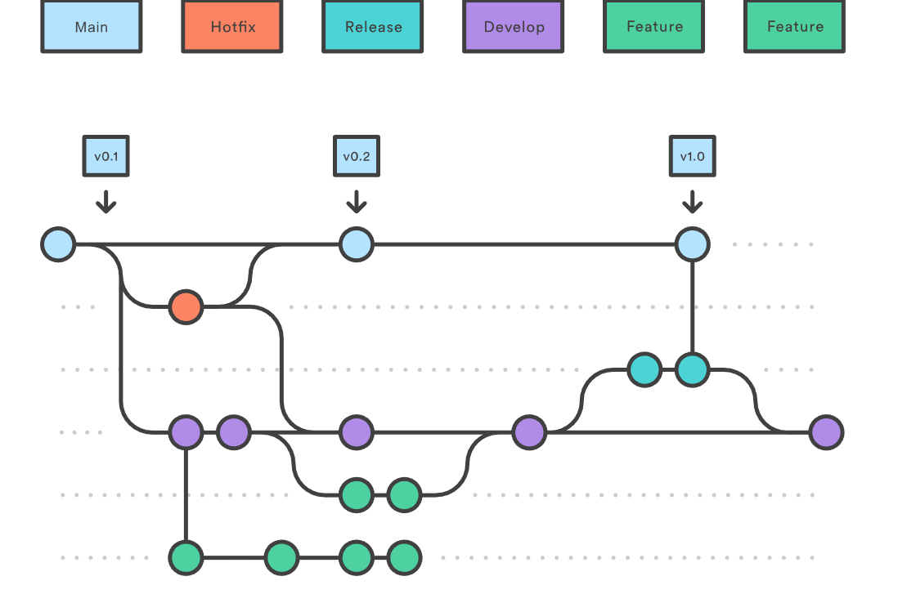
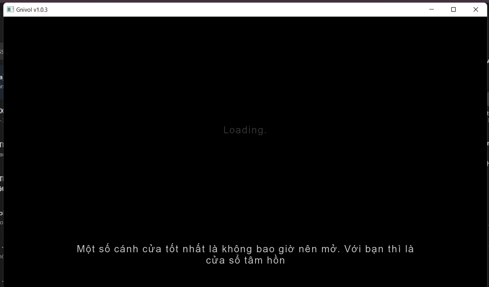
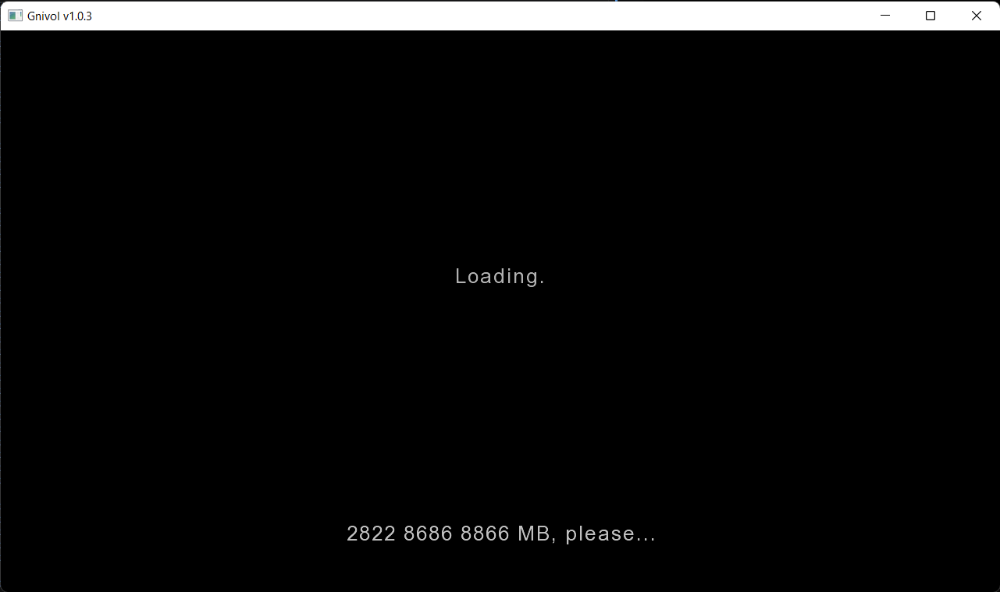
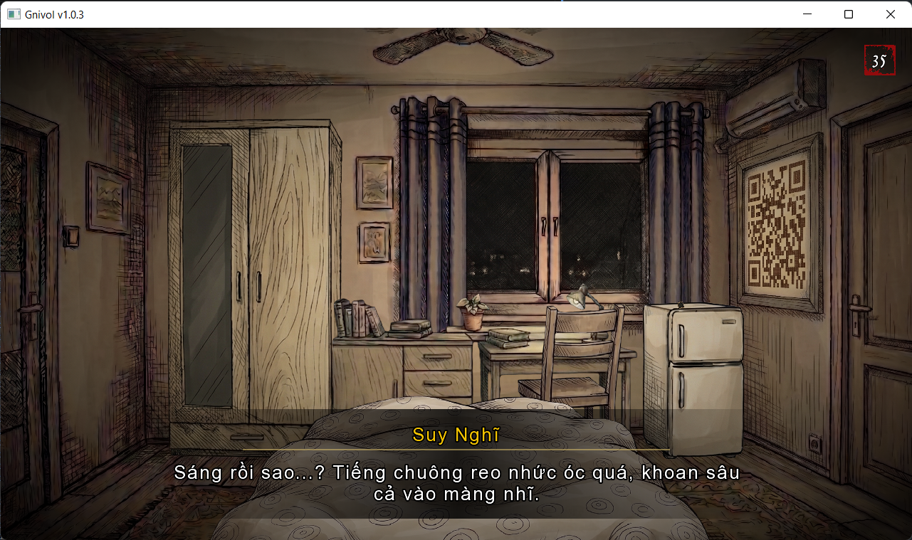
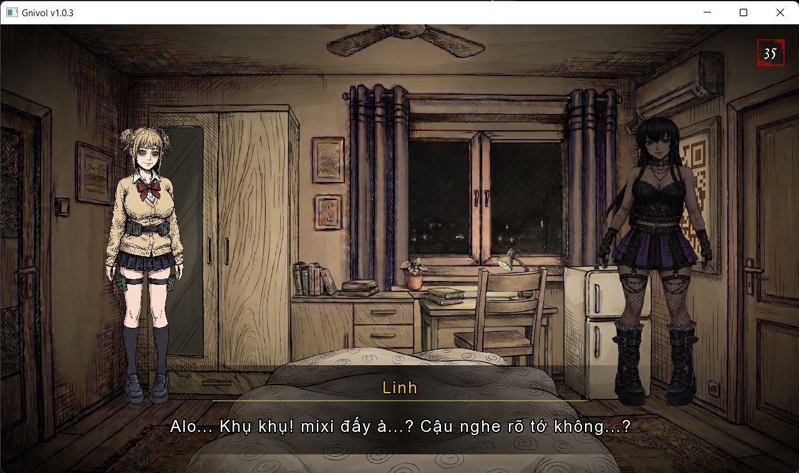
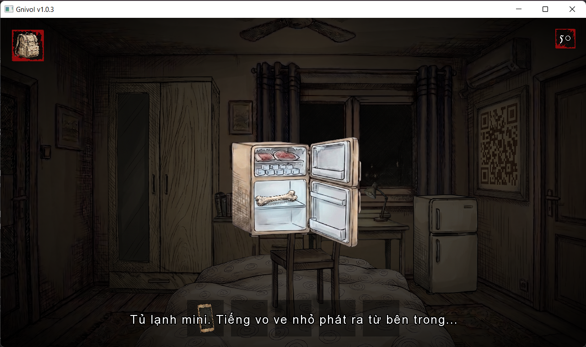
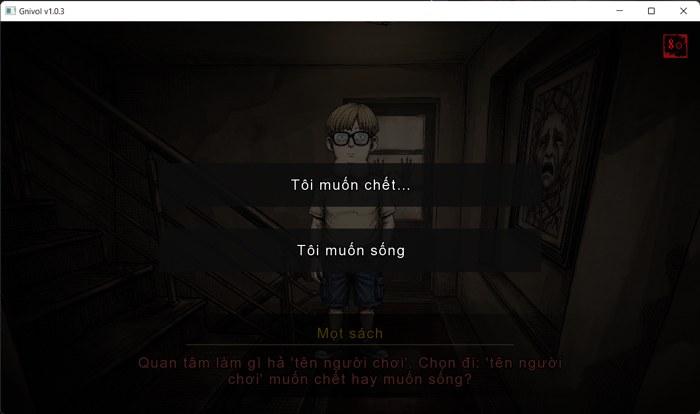
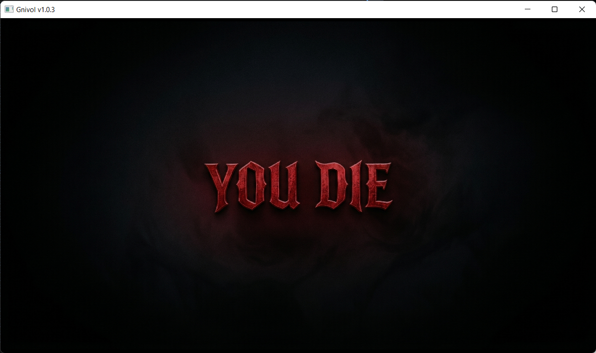
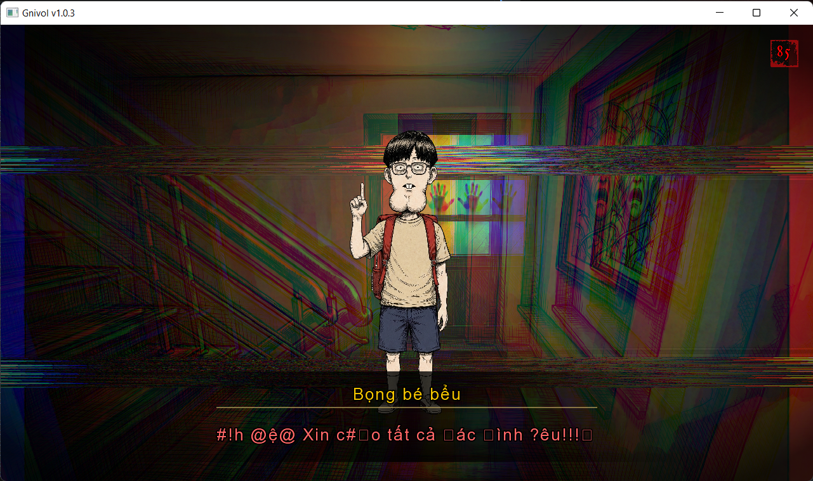
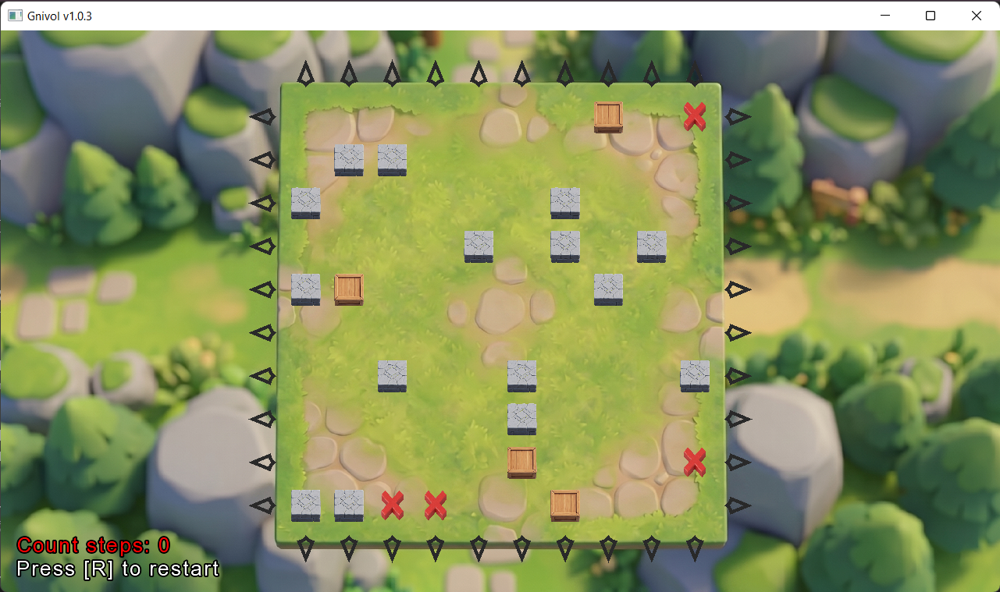

# Reverse Loving - Gnivol

## 1. About

**Tên Dự Án:** Reverse Loving - Gnivol
**Link Dự Án:** [GitHub Link](https://github.com/trieuwu/Gnivol)

### Thành viên

* **[Hà Tiến Triệu]**
    GitHub: https://github.com/trieuwu/
    Contact: 0868668837

* **[Nguyễn Hoàng Tùng]**
    GitHub: https://github.com/Luffyreals
    Contact:  0906279876

* **[Hoàng Duy Anh]**
    GitHub: https://github.com/NaraDuyy
    Contact: 0981499267

* **[Nguyễn Văn Thành]**
    GitHub: https://github.com/NvThanh2809
    Contact: 0335382422

* **[Nguyễn Thành Trung]** — *Project Advisor*
  Contact / Profile: https://github.com/Sagitoaz

### Mô hình làm việc

Nhóm áp dụng phương pháp **Scrumban** (kết hợp giữa Scrum và Kanban) để quản lý tiến độ và tổ chức công việc. Các nhiệm vụ được theo dõi liên tục thông qua hệ thống quản lý **Linear**, đồng thời nhóm duy trì các chu kỳ làm việc ngắn nhằm đánh giá tiến độ và cải tiến quy trình.

- Link linear: [link](https://linear.app/javacore24-finalcontest/team/JAV/all)

Bên cạnh đó, dự án được phát triển theo định hướng **thiết kế dựa trên cốt truyện** (*Narrative-driven development*). Cốt truyện không được cố định ngay từ đầu mà liên tục được xây dựng và điều chỉnh trong suốt quá trình phát triển. Trên cơ sở đó, các yếu tố gameplay, môi trường và trải nghiệm người chơi được thiết kế xoay quanh diễn biến của câu chuyện, nhằm đảm bảo sự nhất quán về mặt cảm xúc và tăng chiều sâu cho trải nghiệm kinh dị tâm lý.

Do giới hạn thời gian phát triển trong 7 tuần, đồng thời toàn bộ thành viên đều chưa có kinh nghiệm làm game và chưa từng sử dụng LibGDX trước đó, phiên bản hiện tại là một **bản demo**.

Tính đến thời điểm hiện tại, dự án mới triển khai được khoảng **1/8 nội dung cốt truyện** đã đề ra. Trong các giai đoạn tiếp theo, trò chơi sẽ tiếp tục được mở rộng và hoàn thiện cả về nội dung lẫn tính năng.

### Chiến lược quản lý mã nguồn

Nhóm áp dụng mô hình **Gitflow** để tổ chức và kiểm soát mã nguồn. Mỗi thành viên sẽ tạo nhánh từ `develop` để làm việc. Các nhánh này sẽ đặt tên theo cấu trúc `feature/ten_chuc_nang`, sau khi hoàn thành sẽ tạo **Pull Request** để cùng kiểm tra code và **Merge** vào `develop`

Quy trình làm việc:

* Mỗi thành viên tạo nhánh từ `develop` để thực hiện chức năng được phân công
* Quy ước đặt tên nhánh: `feature/ten-chuc-nang`
* Sau khi hoàn thành, tạo **Pull Request** để rà soát mã nguồn
* Chỉ hợp nhất (merge) vào `develop` khi đã được kiểm tra và thông qua

Các nhánh chính:

* `main`: Chứa phiên bản ổn định, đã được kiểm thử đầy đủ và sẵn sàng phát hành
* `develop`: Chứa phiên bản tích hợp mới nhất, đã qua rà soát cơ bản
* `feature/*`: Các nhánh phát triển chức năng riêng lẻ, tồn tại ngắn hạn và sẽ được hợp nhất vào `develop` sau khi hoàn thành

## 2. Giới thiệu dự án

**Gnivol_lovinG** là một trò chơi thuộc thể loại **2D Point-and-Click Meta-Horror**, được phát triển trên nền tảng **Java (JDK 24)** và framework **LibGDX**.

Khác với các trò chơi kinh dị truyền thống chỉ tập trung vào yếu tố hù dọa thị giác (*jumpscare*), dự án hướng tới việc **xóa nhòa ranh giới giữa người chơi và phần mềm**, thông qua các cơ chế tác động trực tiếp đến hệ thống và trải nghiệm tâm lý.

Người chơi được đưa vào một không gian tĩnh lặng, ám ảnh với phong cách đồ họa **sketch thô mộc**. Tại đây, mỗi hành động và lựa chọn không chỉ ảnh hưởng đến diễn biến cốt truyện mà còn tác động trực tiếp đến trạng thái vận hành của chính trò chơi.

### Đặc điểm cốt lõi

* **Reality Stability (RS) — Cơ chế ổn định thực tại**
  Một hệ thống điều khiển trạng thái động, cho phép biến đổi môi trường, hình ảnh và âm thanh dựa trên mức độ “ổn định thực tại” của người chơi.

* **Phá vỡ bức tường thứ tư (Meta-horror elements)**
  Trò chơi có khả năng tương tác với hệ điều hành, tạo và chỉnh sửa tệp tin, từ đó làm mờ ranh giới giữa thực và ảo.

* **Bộ nhớ liên tục (Persistent Memory / Silent Save)**
  Hệ thống lưu trữ ngầm hoạt động liên tục, khiến mọi lựa chọn đều mang tính lâu dài và không thể hoàn tác bằng cách tải lại trò chơi.

* **Kiến trúc mở rộng (Scalable Architecture)**
  Áp dụng mô hình **Entity Component System (ECS)** thông qua thư viện **Ashley**, cho phép mở rộng các cơ chế tương tác phức tạp trong khi vẫn đảm bảo hiệu năng.

### Mục tiêu phát triển

Dự án không chỉ hướng tới việc xây dựng một sản phẩm giải trí, mà còn đóng vai trò như một môi trường thực nghiệm nhằm phát triển cả **năng lực kỹ thuật và quy trình làm việc chuyên nghiệp.**

#### a. Mục tiêu kỹ thuật

Dự án nhằm thực nghiệm áp dụng các kiến trúc và kỹ thuật phát triển phần mềm hiện đại, bao gồm:

* **Manager Pattern** để tổ chức và quản lý hệ thống theo hướng tách biệt, dễ bảo trì và mở rộng.
* **Data-driven Design** quản lý dữ liệu thông qua JSON, cho phép thay đổi nội dung mà không cần can thiệp trực tiếp vào mã nguồn.
* **Tối ưu hóa bộ nhớ** với **Texture Atlas** để giảm số lượng draw call và cải thiện hiệu năng hiển thị.

#### b. Mục tiêu quy trình và phát triểnư

* **Quy trình làm việc chuyên nghiệp**
  Áp dụng Git để quản lý mã nguồn, trong đó mỗi tính năng được phát triển trên nhánh riêng. Tất cả thay đổi đều phải thông qua Pull Request và Code Review trước khi hợp nhất vào `develop`.

* **Hiện thực hóa ý tưởng (Idea Deployment)**
  Chuyển hóa các khái niệm trừu tượng của thể loại Meta-horror thành các hệ thống logic cụ thể. Ví dụ, khái niệm “sự bất ổn thực tại” được triển khai thành hệ thống **RSManager**, có khả năng can thiệp vào các thành phần trong trò chơi.

* **Khả năng học tập nhanh (Rapid Learning)**
  Rèn luyện khả năng nghiên cứu và áp dụng nhanh các công nghệ mới. Các thành viên trực tiếp làm việc với các thư viện như **Ashley ECS**, **Box2D Lights** và các cơ chế thao tác tệp trong môi trường LibGDX.

* **Quản trị dự án thực tế**
  Triển khai dự án từ giai đoạn khởi tạo (Skeleton Project) đến việc xây dựng cấu trúc mã nguồn chuẩn hóa, tạo nền tảng cho bảo trì và mở rộng trong tương lai.

## 3. Các Chức Năng Chính

Dựa trên kiến trúc hệ thống hiện tại, các chức năng chính của trò chơi được tổ chức thành các hệ thống độc lập và có khả năng tương tác lẫn nhau như sau:

### 3.1. Hệ thống quản lý cảnh (SceneManager)

* **Cơ chế hoạt động:**
  Sử dụng mô hình **stack-based scene management**, cho phép chuyển đổi linh hoạt giữa các cảnh chính (Room) và các lớp phủ (Overlay) mà không làm mất trạng thái hiện tại.

* **Quản lý trạng thái:**
  Dữ liệu phòng được lưu trữ và tái sử dụng thông qua cache, đảm bảo tính liên tục khi người chơi quay lại các khu vực đã đi qua.

* **Tích hợp âm thanh:**
  Tự động chuyển đổi nhạc nền (BGM crossfade) khi thay đổi cảnh thông qua `sceneBgmMap`, giúp duy trì trải nghiệm liền mạch.

### 3.2. Hệ thống cắt cảnh theo kịch bản (CutsceneManager)

* **Cơ chế hoạt động:**
  Vận hành theo mô hình **step-based processor**, trong đó mỗi phân cảnh được định nghĩa dưới dạng tập lệnh JSON (`cutscenes.json`) và được thực thi tuần tự theo thời gian.

* **Khả năng mở rộng:**
  Hỗ trợ nhiều loại tác vụ (step types) như:

  * Rung màn hình (*shake*)
  * Hiệu ứng lóe sáng (*flash*)
  * Phát video
  * Thay đổi chỉ số RS
  * Kích hoạt minigame

* **Tích hợp hệ thống:**
  Có thể tương tác trực tiếp với các hệ thống khác như `SceneManager`, `RSManager` và `DialogueEngine`.

### 3.3. Cơ chế thực tại động (RSManager)

* **Mô hình dữ liệu:**
  Chỉ số RS vận hành trong khoảng **0–100**, với vùng ổn định mặc định từ **35–65**.

* **Cơ chế phản hồi:**
  Khi vượt ngưỡng, hệ thống tự động kích hoạt:

  * Hiệu ứng hình ảnh (camera shake, glitch shader theo chu kỳ)
  * Thay đổi trạng thái môi trường và âm thanh

* **Tác động gameplay:**
  Sự biến động của RS ảnh hưởng trực tiếp đến tiến trình trò chơi, bao gồm việc dẫn đến nhiều kết thúc khác nhau.

### 3.4. Hệ thống hội thoại và suy nghĩ (Dialogue & Thought Engine)

* **Hội thoại phân nhánh:**
  Sử dụng cấu trúc **Dialogue Tree** để triển khai các luồng hội thoại phức tạp, với tốc độ hiển thị ~0.05s/ký tự và hỗ trợ hiển thị đồng thời hai chân dung nhân vật.

* **Hiệu ứng hiển thị:**
  Tích hợp các hiệu ứng như typewriter, glitch văn bản và thay đổi trạng thái UI theo ngữ cảnh.

* **Suy nghĩ theo trạng thái RS:**
  Dữ liệu từ `thoughts.json` được phân loại theo các mức RS (**LOW / MID / HIGH**), từ đó thay đổi cách mô tả và cảm nhận của nhân vật đối với môi trường.

### 3.5. Hệ thống lưu trữ và trạng thái trò chơi (Save/Load)

* **Kiến trúc lưu trữ:**
  Sử dụng interface `ISaveable` để đồng bộ dữ liệu từ nhiều hệ thống (Inventory, Puzzle, Flag...) vào một đối tượng `GameSnapshot` duy nhất dưới dạng JSON.

* **Tự động lưu:**
  `AutoSaveManager` kích hoạt cơ chế lưu tại các sự kiện quan trọng như:

  * Nhặt vật phẩm
  * Kết thúc hội thoại
  * Chuyển cảnh

* **Lưu trữ vật lý:**
  Dữ liệu được ghi trực tiếp vào hệ thống tệp tại đường dẫn:
  `.gnivol/save_slot_1.json`, đảm bảo tính liên tục và không thể hoàn tác của trải nghiệm.

## 4. Công nghệ

### 4.1. Công nghệ sử dụng

* **Java (JDK 8+)**
  Ngôn ngữ lập trình chính, tận dụng lập trình hướng đối tượng để xây dựng các hệ thống phức tạp.

* **LibGDX 1.14.0**
  Framework phát triển game mã nguồn mở, cung cấp API cho đồ họa, âm thanh và xử lý input.

* **LWJGL3**
  Backend cho nền tảng Desktop, hỗ trợ giao tiếp trực tiếp với phần cứng và driver đồ họa.

* **Gradle**
  Công cụ tự động hóa build, quản lý thư viện và đóng gói dự án theo mô hình đa module.

* **GLSL**
  Ngôn ngữ shader trên GPU, được sử dụng để xây dựng các hiệu ứng hình ảnh như glitch và chroma key.

### 4.2. Quản lý dữ liệu

Dự án được thiết kế theo hướng **data-driven**, cho phép thay đổi nội dung mà không cần chỉnh sửa mã nguồn:

* **JSON**
  Định dạng dữ liệu chính cho các hệ thống như phòng chơi (Room), hội thoại (Dialogue), cắt cảnh (Cutscene), vật phẩm (Item) và suy nghĩ nhân vật (Thought).

* **Reflection (LibGDX Json)**
  Tự động ánh xạ dữ liệu từ file JSON vào các đối tượng Java (POJO) thông qua `DataManager`.

* **AssetManager**
  Quản lý việc nạp tài nguyên (texture, âm thanh, font) theo cơ chế bất đồng bộ, giúp giảm giật lag khi chuyển cảnh.

### 4.3. Kiến trúc phần mềm

Dự án áp dụng nhiều mẫu thiết kế nhằm đảm bảo tính mở rộng và khả năng bảo trì:

* **Manager Pattern**
  Tập trung hóa các hệ thống chuyên biệt như `AudioManager`, `RSManager`, `SceneManager`.

* **Observer Pattern**
  Sử dụng cơ chế lắng nghe (listener) để đồng bộ dữ liệu giữa các hệ thống (ví dụ: `RSListener` cập nhật UI khi chỉ số RS thay đổi).

* **Stack-based Architecture**
  Quản lý các cảnh và lớp phủ (overlay) dưới dạng ngăn xếp, cho phép hiển thị nhiều lớp tương tác đồng thời.

* **Entity Component System (ECS)**
  Áp dụng thông qua thư viện **Ashley**, giúp quản lý các thực thể theo hướng thành phần, tối ưu hiệu năng và khả năng mở rộng.

### 4.4. Cấu trúc dự án

  Do phần mô tả cấu trúc dự án **Gnivol** khá dài (hơn 500 dòng), nội dung này đã được tách sang một file riêng để thuận tiện theo dõi. Toàn bộ sơ đồ phân cấp có thể xem tại đây:
  
   **[Gnivol_Project_Tree.md](./Gnivol_Project_Tree.md)**

## 5. Ảnh và Video Demo

**Ảnh Demo:**

#### Và đó mới chỉ là một phần nhỏ của những gì đang chờ bạn trong **Gnivol**. Hãy tự mình trải nghiệm trò chơi để khám phá phần còn lại.

**Video Demo:**
[Video Link](#)

## 6. Các vấn đề gặp phải

### 6.1. Tiến độ sản xuất Assets không đồng bộ với tiến độ lập trình

Hệ thống mã nguồn phát triển nhanh trong khi quá trình sản xuất hình ảnh và âm thanh theo phong cách Sketch-style tốn nhiều thời gian, dẫn đến tình trạng “nghẽn cổ chai” ảnh hưởng đến tiến độ chung của dự án.

#### Hành động để giải quyết

- **Module hóa Assets để tối ưu nguồn lực:**  
  Chia nhỏ các bộ Assets thành nhiều thành phần riêng biệt như layers hoặc individual objects để các thành viên khác có thể hỗ trợ tìm kiếm hoặc tham gia sản xuất.

- **Ưu tiên Placeholder Assets:**  
  Hoàn thiện trước các Assets khung nhằm giúp anh em code có thể triển khai logic gameplay với dữ liệu mẫu trong khi chờ tài nguyên chính thức.

#### Kết quả

Tiến độ giữa bộ phận Lập trình và Mỹ thuật đạt trạng thái cân bằng hơn. Thời gian chờ đợi dữ liệu để debug giảm đáng kể, giúp Engine luôn có tài nguyên để vận hành liên tục.

### 6.2. Xung đột mã nguồn (Conflicts) và quy trình phối hợp nhóm chưa chặt chẽ

Việc nhiều thành viên cùng chỉnh sửa các Manager cốt lõi dẫn đến xung đột mã nguồn thường xuyên khi Merge. Ngoài ra, một số lỗi phát sinh do quy trình Code Review chưa được thực hiện đầy đủ.

#### Hành động để giải quyết

- **Chuẩn hóa quy trình làm việc nhóm:**  
  Sử dụng công cụ [Linear](https://linear.app/javacore24-finalcontest/team/JAV/all) để phân chia nhiệm vụ chi tiết, đảm bảo mỗi thành viên phụ trách một module riêng nhằm hạn chế chồng chéo mã nguồn.

- **Thiết lập quy trình Code Review bắt buộc:**  
  Thành viên trong nhóm phải kiểm tra mã nguồn của nhau trước khi thực hiện Pull Request (PR) và Merge vào nhánh chính.

- **Tổ chức họp kỹ thuật định kỳ:**  
  Thống nhất kiến trúc hệ thống và cùng xử lý các lỗi phát sinh từ nhiều phần việc khác nhau.

#### Kết quả

Tỷ lệ xung đột mã nguồn giảm đáng kể, quá trình Merge trở nên ổn định và mượt mà hơn. Chất lượng mã nguồn được cải thiện khi nhiều lỗi logic được phát hiện ngay từ bước Review thay vì đến giai đoạn kiểm thử.

### 6.3. Hệ thống nạp dữ liệu (Loading System) phức tạp và phát sinh nhiều lỗi kỹ thuật

Kiến trúc Data-driven yêu cầu nạp đồng thời nhiều loại dữ liệu như Rooms, Dialogues và Items từ các tệp JSON, dẫn đến nhiều lỗi liên quan đến quản lý tài nguyên bất đồng bộ hoặc ánh xạ dữ liệu không chính xác.

#### Hành động để giải quyết

- **Tối ưu hóa hệ thống DataManager và AssetManager:**  
  Tập trung quản lý việc nạp tài nguyên nhằm đảm bảo tính đồng bộ và ổn định của dữ liệu.

- **Xây dựng lại LoadingScreen:**  
  Đảm bảo toàn bộ hình ảnh, âm thanh và dữ liệu JSON được tải hoàn chỉnh trước khi chuyển vào màn hình chơi chính.

- **Rà soát các lớp dữ liệu:**  
  Tối ưu và sửa lỗi cho các lớp như `RoomData`, `ItemData` nhằm đảm bảo quá trình đọc dữ liệu JSON luôn chính xác.

#### Kết quả

Hệ thống Load game hoạt động ổn định hơn, loại bỏ phần lớn tình trạng crash do thiếu tài nguyên hoặc lỗi dữ liệu. Trải nghiệm chuyển cảnh của người chơi trở nên mượt mà và đáng tin cậy hơn.

### 6.4. Rào cản từ các mảng kiến thức chuyên môn mới

Dự án áp dụng nhiều công nghệ chuyên sâu như ECS, Shaders và Meta-file system — những lĩnh vực mà các thành viên chưa từng tiếp cận trước đây — khiến kiến trúc ban đầu chưa thể bao quát hết các vấn đề phát sinh.

#### Hành động để giải quyết

- **Áp dụng tư duy học tập thích nghi nhanh (Rapid Learning):**  
  Chủ động nghiên cứu tài liệu, thử nghiệm công nghệ mới và liên tục tái cấu trúc hệ thống trong quá trình phát triển.

- **Ứng dụng Design Patterns:**  
  Sử dụng các mô hình như Manager Pattern, Observer (Listener) và Strategy nhằm tách biệt các hệ thống phức tạp và hỗ trợ xử lý bug hiệu quả hơn.

- **Ưu tiên tối ưu trải nghiệm người chơi:**  
  Tập trung xử lý các bug tồn đọng và cải thiện tính ổn định trước khi bổ sung thêm tính năng mới.

#### Kết quả

Đội ngũ đã làm chủ được nhiều công nghệ khó trong thời gian ngắn. Kiến trúc dự án từ trạng thái rời rạc dần trở thành một hệ thống có tính mở rộng cao (Scalable), tạo nền tảng vững chắc cho việc phát triển toàn bộ cốt truyện trong tương lai.

# 7. Kết luận

## 7.1. Kết quả đạt được

Sau giai đoạn triển khai vừa qua, dự án đã đạt được nhiều cột mốc kỹ thuật quan trọng, tạo nền tảng vững chắc cho việc phát triển một sản phẩm Meta-horror hoàn chỉnh.

- **Xây dựng thành công “Mini-Engine” cốt lõi:**  
  Thiết lập hệ thống nền tảng dựa trên LibGDX 1.14.0 và Java 8+, cho phép trò chơi vận hành ổn định và mượt mà trên môi trường Desktop.

- **Hoàn thiện kiến trúc Data-driven:**  
  Toàn bộ nội dung như Rooms, Dialogues, Items và Cutscenes được tách biệt khỏi mã nguồn thông qua hệ thống tệp JSON, giúp việc mở rộng nội dung trở nên linh hoạt mà không cần can thiệp trực tiếp vào code.

- **Triển khai các cơ chế Meta-horror đặc trưng:**  
  Hiện thực hóa hệ thống Reality Stability (RS) có khả năng tác động trực tiếp đến Shader và Render Pipeline nhằm tạo ra các hiệu ứng nhiễu loạn thực tại mang tính tâm lý.

- **Xây dựng hệ thống tương tác và giải đố chuyên sâu:**  
  Tích hợp thành công hệ thống quản lý Scene theo Stack, cơ chế nhặt/ghép vật phẩm và nhiều Minigame như xếp hình, giải đố Laser.

- **Chuẩn hóa quy trình phát triển:**  
  Thiết lập cấu trúc Package rõ ràng với hơn 50 tệp Java cùng các công cụ Debug/Cheat hỗ trợ kiểm thử, giúp tối ưu hóa quá trình phát triển và làm việc nhóm.

## 7.2. Hướng phát triển tiếp theo

Phiên bản hiện tại đóng vai trò là một bản **Technical Demo**, hoàn thiện phần khung kỹ thuật và triển khai khoảng **1/8 nội dung cốt truyện** dự kiến.

Trong tương lai, dự án sẽ tiếp tục được phát triển theo các hướng sau:

- **Mở rộng toàn bộ cốt truyện:**  
  Tiếp tục triển khai 7 phần còn lại của kịch bản, mở rộng số lượng phòng chơi và xây dựng thêm nhiều khu vực với cấu trúc phức tạp hơn.

- **Nâng cấp hệ thống Meta-elements:**  
  Hoàn thiện `EndingManager` để triển khai các cơ chế phá vỡ bức tường thứ tư (Fourth-wall breaking) theo hướng tinh vi và chân thực hơn.

- **Đa dạng hóa hệ thống giải đố:**  
 Tích hợp thêm nhiều loại Minigame mới, đồng thời phát triển cơ chế phản ứng động cho các thực thể trong game dựa trên trạng thái Reality Stability (RS) của người chơi. NPC sẽ không hoạt động theo kịch bản cố định mà có khả năng thay đổi thái độ, lời thoại và tần suất xuất hiện thông qua dữ liệu được truy xuất từ `RSManager`.

- **Tối ưu hóa trải nghiệm nghe nhìn:**  
  Nâng cấp chất lượng Asset vẽ tay theo phong cách Sketch-style kết hợp với hệ thống Spatial Audio nhằm tăng cường cảm giác căng thẳng và ám ảnh.

- **Hoàn thiện các nhánh kết thúc:**  
  Phát triển đầy đủ các tuyến Ending khác nhau (hiện tại đã có 6 Ending mẫu) nhằm gia tăng giá trị chơi lại và chiều sâu trải nghiệm.

> Và đó mới chỉ là một phần nhỏ của những gì đang chờ đợi phía trước trong **Gnivol**.  
> Hãy tự mình trải nghiệm trò chơi để khám phá phần còn lại.

> Thực hiện bởi thành viên **CLB Lập trình PTIT - ProPTIT** thuộc **Học viện Công nghệ Bưu chính Viễn thông (PTIT)**
Cùng sự hỗ trợ của **Gemini 3 Pro**, Chat GPT 4o, **Claude Opus 4.6 Extended** cùng nhiều trang thông tin và tham khảo rất nhiều tựa game khác v.v... 