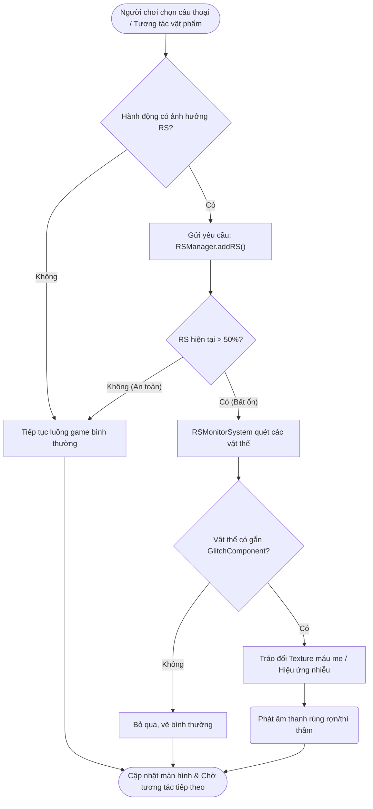

```mermaid
flowchart TD
    %% Khởi đầu sự kiện
    Start(["Người chơi chọn câu thoại / Tương tác vật phẩm"]) --> CheckEvent{"Hành động có ảnh hưởng RS?"}
    
    %% Xử lý logic lõi (Model)
    CheckEvent -- "Không" --> NormalPlay["Tiếp tục luồng game bình thường"]
    CheckEvent -- "Có" --> UpdateRS["Gửi yêu cầu: RSManager.addRS()"]
    UpdateRS --> CheckThreshold{"RS hiện tại > 50%?"}
    
    %% Xử lý an toàn
    CheckThreshold -- "Không (An toàn)" --> NormalPlay
    
    %% Xử lý hệ thống ECS (System quét Component)
    CheckThreshold -- "Có (Bất ổn)" --> ECS_Scan["RSMonitorSystem quét các vật thể"]
    ECS_Scan --> FindGlitch{"Vật thể có gắn GlitchComponent?"}
    
    %% Xử lý Phản hồi thị giác/Âm thanh
    FindGlitch -- "Không" --> SkipEntity["Bỏ qua, vẽ bình thường"]
    FindGlitch -- "Có" --> TriggerVisual["Tráo đổi Texture máu me / Hiệu ứng nhiễu"]
    TriggerVisual --> TriggerAudio("Phát âm thanh rùng rợn/thì thầm")
    
    TriggerAudio --> EndEvent(["Cập nhật màn hình & Chờ tương tác tiếp theo"])
    NormalPlay --> EndEvent
    SkipEntity --> EndEvent
```