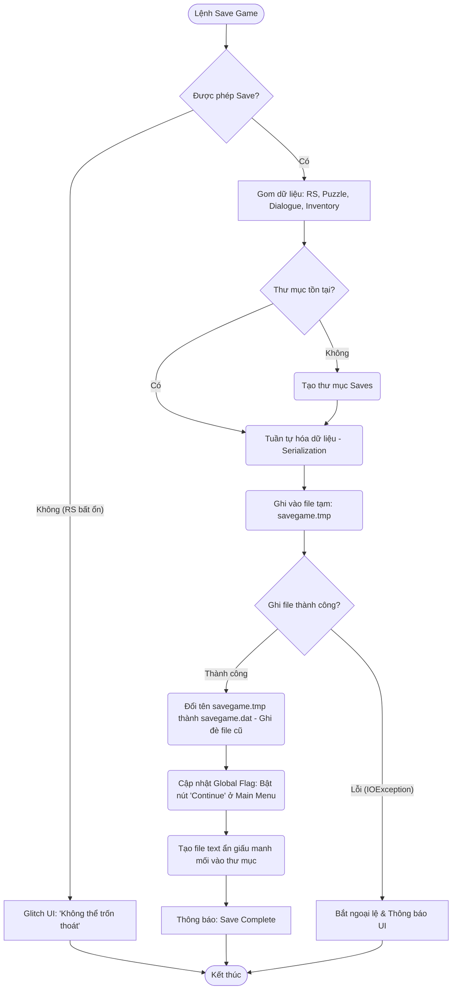

```mermaid
flowchart TD
    Start([Lệnh Save Game]) --> CheckCondition{Được phép Save?}
    
    CheckCondition -- "Không (RS bất ổn)" --> Deny[Glitch UI: 'Không thể trốn thoát'] --> End([Kết thúc])
    CheckCondition -- "Có" --> Collect[Gom dữ liệu: RS, Puzzle, Dialogue, Inventory]
    
    Collect --> CheckDir{Thư mục tồn tại?}
    CheckDir -- "Không" --> CreateDir(Tạo thư mục Saves)
    CheckDir -- "Có" --> Serialize
    
    CreateDir --> Serialize(Tuần tự hóa dữ liệu - Serialization)
    Serialize --> WriteTemp(Ghi vào file tạm: savegame.tmp)
    
    WriteTemp --> Verify{Ghi file thành công?}
    Verify -- "Lỗi (IOException)" --> CatchErr[Bắt ngoại lệ & Thông báo UI]
    
    Verify -- "Thành công" --> Rename(Đổi tên savegame.tmp thành savegame.dat - Ghi đè file cũ)
    Rename --> GlobalUpdate(Cập nhật Global Flag: Bật nút 'Continue' ở Main Menu)
    GlobalUpdate --> MetaGift(Tạo file text ẩn giấu manh mối vào thư mục)
    
    MetaGift --> Success[Thông báo: Save Complete]
    Success --> End
    CatchErr --> End
```