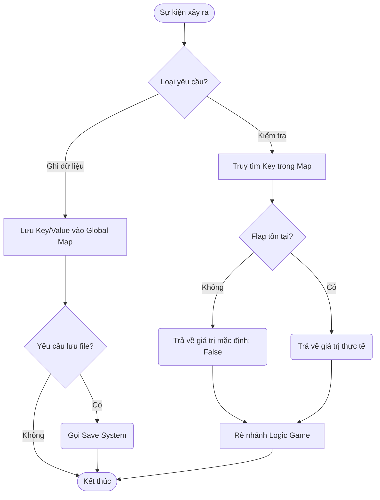
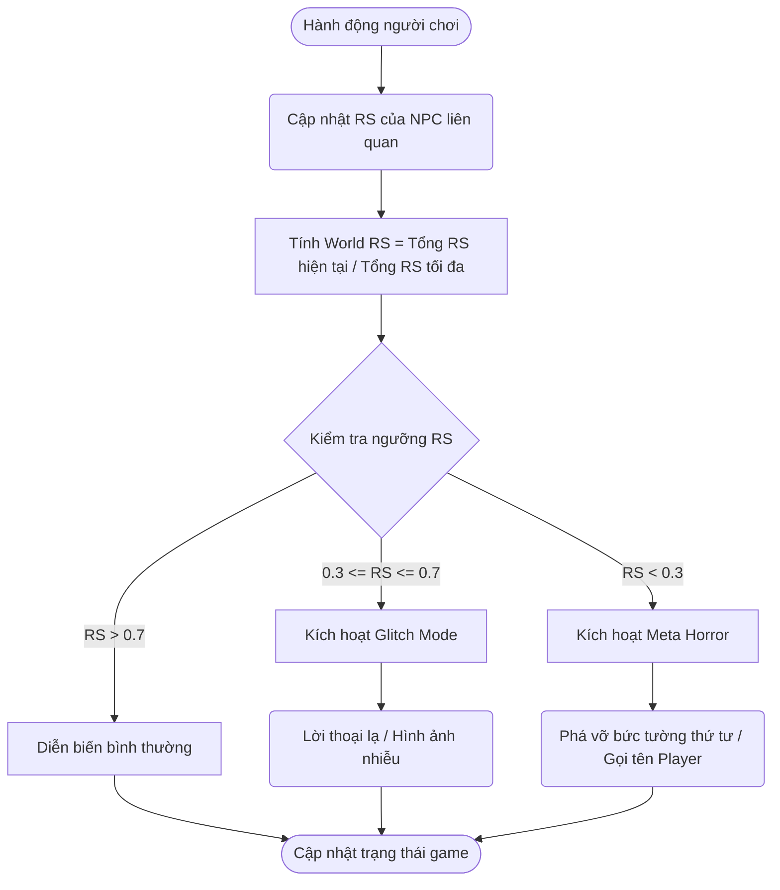
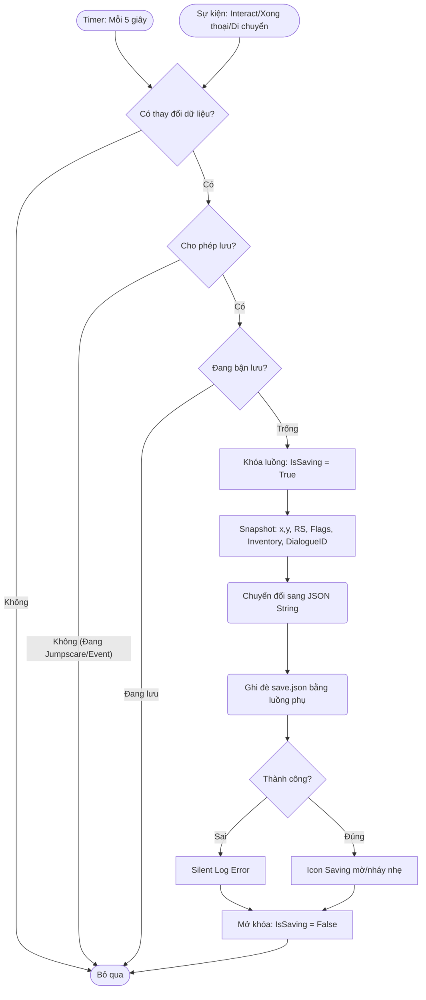

```mermaid
flowchart TD
    Start([Kích hoạt Sự kiện cuối]) --> FetchData(Truy xuất World RS & Global Flags)
    FetchData --> ConditionCheck{Kiểm tra điều kiện}
    
    %% Nhánh True Ending
    ConditionCheck -- "RS > 80% + Đủ Item ẩn" --> TrueEnd[True Ending: Thực tại ổn định]
    
    %% Nhánh Hidden Ending (Dành cho dân cày)
    ConditionCheck -- "Đạt Flag đặc biệt" --> SecretEnd[Secret Ending: Sự thật về thế giới]
    
    %% Nhánh Normal Ending
    ConditionCheck -- "50% < RS < 80%" --> NormalEnd[Normal Ending: Kết thúc mở]
    
    %% Nhánh Bad/Horror Ending (Meta)
    ConditionCheck -- "RS < 30%" --> HorrorEnd[Horror Ending: Thực tại sụp đổ]
    
    HorrorEnd --> MetaAction(Xóa file save/Gửi thông điệp qua System)
    
    TrueEnd --> PlayCredits(Chạy Credits)
    SecretEnd --> PlayCredits
    NormalEnd --> PlayCredits
    MetaAction --> PlayCredits
    
    PlayCredits --> End([Trở về Main Menu])
```
---

```mermaid
flowchart TD
    Start([Sự kiện xảy ra]) --> RequestType{Loại yêu cầu?}
    
    %% Luồng cập nhật
    RequestType -- "Ghi dữ liệu" --> UpdateFlag[Lưu Key/Value vào Global Map]
    UpdateFlag --> AutoSave{Yêu cầu lưu file?}
    AutoSave -- "Có" --> TriggerSave(Gọi Save System)
    AutoSave -- "Không" --> End([Kết thúc])
    TriggerSave --> End

    %% Luồng truy vấn (Dùng cho rẽ nhánh)
    RequestType -- "Kiểm tra" --> QueryMap[Truy tìm Key trong Map]
    QueryMap --> ExistCheck{Flag tồn tại?}
    
    ExistCheck -- "Không" --> DefaultValue(Trả về giá trị mặc định: False)
    ExistCheck -- "Có" --> GetValue(Trả về giá trị thực tế)
    
    DefaultValue --> LogicBranch[Rẽ nhánh Logic Game]
    GetValue --> LogicBranch
    LogicBranch --> End
```
---

```mermaid
flowchart TD
    Start([Hành động người chơi]) --> ChangeRS(Cập nhật RS của NPC liên quan)
    ChangeRS --> CalcWorldRS[Tính World RS = Tổng RS hiện tại / Tổng RS tối đa]
    
    CalcWorldRS --> Threshold{Kiểm tra ngưỡng RS}
    
    %% Nhánh bình thường
    Threshold -- "RS > 0.7" --> Normal[Diễn biến bình thường]
    Normal --> End([Cập nhật trạng thái game])
    
    %% Nhánh bất ổn (Glitch)
    Threshold -- "0.3 <= RS <= 0.7" --> Unstable[Kích hoạt Glitch Mode]
    Unstable --> GlitchEffect(Lời thoại lạ / Hình ảnh nhiễu)
    GlitchEffect --> End
    
    %% Nhánh sụp đổ (Meta/Horror)
    Threshold -- "RS < 0.3" --> Broken[Kích hoạt Meta Horror]
    Broken --> FourthWall(Phá vỡ bức tường thứ tư / Gọi tên Player)
    FourthWall --> End
```
---

```mermaid
flowchart TD
    %% Các nguồn kích hoạt Silent Save
    T1([Timer: Mỗi 5 giây]) --> DirtyCheck{Có thay đổi dữ liệu?}
    T2([Sự kiện: Interact/Xong thoại/Di chuyển]) --> DirtyCheck
    
    DirtyCheck -- "Không" --> End([Bỏ qua])
    DirtyCheck -- "Có" --> Permission{Cho phép lưu?}

    %% Kiểm tra trạng thái đặc biệt
    Permission -- "Không (Đang Jumpscare/Event)" --> End
    
    Permission -- "Có" --> LockCheck{Đang bận lưu?}
    LockCheck -- "Đang lưu" --> End
    
    LockCheck -- "Trống" --> Lock[Khóa luồng: IsSaving = True]
    
    %% Quy trình gom dữ liệu và ghi JSON
    Lock --> Collect[Snapshot: x,y, RS, Flags, Inventory, DialogueID]
    Collect --> ToJson(Chuyển đổi sang JSON String)
    ToJson --> AsyncWrite(Ghi đè save.json bằng luồng phụ)
    
    AsyncWrite --> Verify{Thành công?}
    
    Verify -- "Sai" --> Catch[Silent Log Error]
    Verify -- "Đúng" --> UI[Icon Saving mờ/nháy nhẹ]
    
    Catch --> Unlock[Mở khóa: IsSaving = False]
    UI --> Unlock
    Unlock --> End
```
