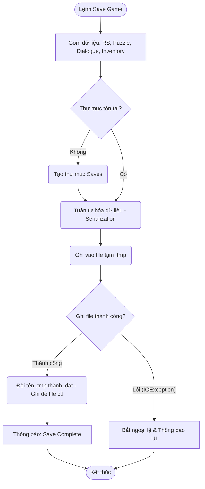
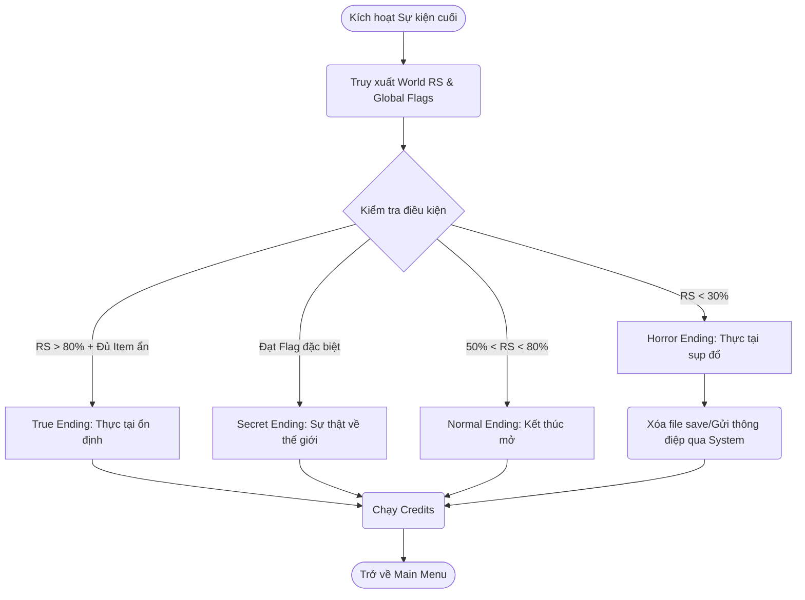
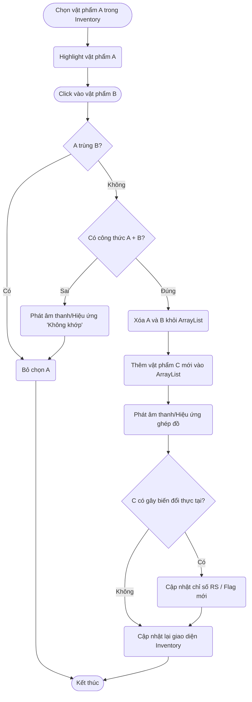

```mermaid
flowchart TD
    Start([Lệnh Save Game]) --> Collect[Gom dữ liệu: RS, Puzzle, Dialogue, Inventory]
    Collect --> CheckDir{Thư mục tồn tại?}

    CheckDir -- "Không" --> CreateDir(Tạo thư mục Saves)
    CreateDir --> Serialize
    CheckDir -- "Có" --> Serialize(Tuần tự hóa dữ liệu - Serialization)

    Serialize --> WriteTemp(Ghi vào file tạm .tmp)
    WriteTemp --> Verify{Ghi file thành công?}

    Verify -- "Lỗi (IOException)" --> CatchErr[Bắt ngoại lệ & Thông báo UI]
    Verify -- "Thành công" --> Rename(Đổi tên .tmp thành .dat - Ghi đè file cũ)

    Rename --> Success[Thông báo: Save Complete]
    Success --> End([Kết thúc])
    CatchErr --> End
```
---

```mermaid
flowchart TD
    Start([Kích hoạt Sự kiện cuối]) --> FetchData(Truy xuất World RS & Global Flags)
    FetchData --> ConditionCheck{Kiểm tra điều kiện}
    
    %% Nhánh True Ending
    ConditionCheck -- "RS > 80% + Đủ Item ẩn" --> TrueEnd[True Ending: Thực tại ổn định]
    
    %% Nhánh Hidden Ending (Dành cho dân cày)
    ConditionCheck -- "Đạt Flag đặc biệt" --> SecretEnd[Secret Ending: Sự thật về thế giới]
    
    %% Nhánh Normal Ending
    ConditionCheck -- "50% < RS < 80%" --> NormalEnd[Normal Ending: Kết thúc mở]
    
    %% Nhánh Bad/Horror Ending (Meta)
    ConditionCheck -- "RS < 30%" --> HorrorEnd[Horror Ending: Thực tại sụp đổ]
    
    HorrorEnd --> MetaAction(Xóa file save/Gửi thông điệp qua System)
    
    TrueEnd --> PlayCredits(Chạy Credits)
    SecretEnd --> PlayCredits
    NormalEnd --> PlayCredits
    MetaAction --> PlayCredits
    
    PlayCredits --> End([Trở về Main Menu])
```
---

```mermaid
flowchart TD
    Start([Sự kiện xảy ra]) --> RequestType{Loại yêu cầu?}
    
    %% Luồng cập nhật
    RequestType -- "Ghi dữ liệu" --> UpdateFlag[Lưu Key/Value vào Global Map]
    UpdateFlag --> AutoSave{Yêu cầu lưu file?}
    AutoSave -- "Có" --> TriggerSave(Gọi Save System)
    AutoSave -- "Không" --> End([Kết thúc])
    TriggerSave --> End

    %% Luồng truy vấn (Dùng cho rẽ nhánh)
    RequestType -- "Kiểm tra" --> QueryMap[Truy tìm Key trong Map]
    QueryMap --> ExistCheck{Flag tồn tại?}
    
    ExistCheck -- "Không" --> DefaultValue(Trả về giá trị mặc định: False)
    ExistCheck -- "Có" --> GetValue(Trả về giá trị thực tế)
    
    DefaultValue --> LogicBranch[Rẽ nhánh Logic Game]
    GetValue --> LogicBranch
    LogicBranch --> End
```
---

```mermaid
flowchart TD
    Start([Hành động người chơi]) --> ChangeRS(Cập nhật RS của NPC liên quan)
    ChangeRS --> CalcWorldRS[Tính World RS = Tổng RS hiện tại / Tổng RS tối đa]
    
    CalcWorldRS --> Threshold{Kiểm tra ngưỡng RS}
    
    %% Nhánh bình thường
    Threshold -- "RS > 0.7" --> Normal[Diễn biến bình thường]
    Normal --> End([Cập nhật trạng thái game])
    
    %% Nhánh bất ổn (Glitch)
    Threshold -- "0.3 <= RS <= 0.7" --> Unstable[Kích hoạt Glitch Mode]
    Unstable --> GlitchEffect(Lời thoại lạ / Hình ảnh nhiễu)
    GlitchEffect --> End
    
    %% Nhánh sụp đổ (Meta/Horror)
    Threshold -- "RS < 0.3" --> Broken[Kích hoạt Meta Horror]
    Broken --> FourthWall(Phá vỡ bức tường thứ tư / Gọi tên Player)
    FourthWall --> End
```
---

```mermaid
flowchart TD
    Start([Chọn vật phẩm A trong Inventory]) --> Highlight(Highlight vật phẩm A)
    Highlight --> SelectB([Click vào vật phẩm B])
    
    SelectB --> SameCheck{A trùng B?}
    SameCheck -- "Có" --> Deselect(Bỏ chọn A)
    Deselect --> End([Kết thúc])
    
    SameCheck -- "Không" --> RecipeCheck{Có công thức A + B?}
    
    %% Nhánh thất bại
    RecipeCheck -- "Sai" --> FailAnim(Phát âm thanh/Hiệu ứng 'Không khớp')
    FailAnim --> Deselect
    
    %% Nhánh thành công
    RecipeCheck -- "Đúng" --> MergeAction(Xóa A và B khỏi ArrayList)
    MergeAction --> CreateNew(Thêm vật phẩm C mới vào ArrayList)
    CreateNew --> PlaySuccess(Phát âm thanh/Hiệu ứng ghép đồ)
    PlaySuccess --> RSCheck{C có gây biến đổi thực tại?}
    
    RSCheck -- "Có" --> UpdateRS(Cập nhật chỉ số RS / Flag mới)
    RSCheck -- "Không" --> RefreshUI(Cập nhật lại giao diện Inventory)
    
    UpdateRS --> RefreshUI
    RefreshUI --> End
```