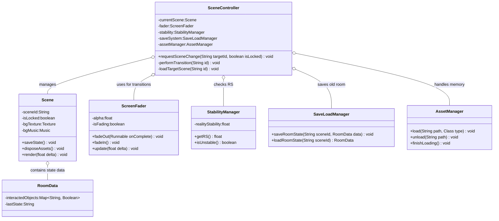
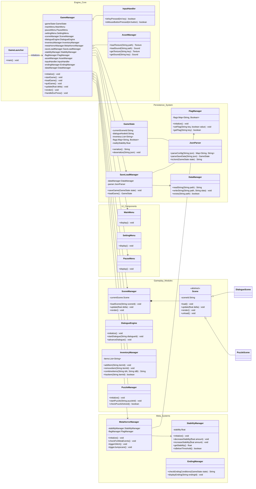

```mermaid
classDiagram
    class GameLauncher {
        +main() void
    }

    class GameManager {
        -gameState : GameState
        -mainMenu : MainMenu
        -pauseMenu : PauseMenu
        -settingMenu : SettingMenu
        -sceneManager : SceneManager
        -dialogueEngine : DialogueEngine
        -inventoryManager : InventoryManager
        -metaHorrorManager : MetaHorrorManager
        -saveLoadManager : SaveLoadManager
        -stabilityManager : StabilityManager
        -flagManager : FlagManager
        -assetManager : AssetManager
        -inputHandler : InputHandler
        -endingManager : EndingManager
        -dataManager : DataManager
        +initialize() void
        +startGame() void
        +loadGame() void
        +quitGame() void
        +update(float delta) void
        +render() void
        +handleEscPress() void
    }

    class GameState {
        -currentSceneId : String
        -dialogueNodeId : String
        -inventory : List~String~
        -flags : Map~String, Boolean~
        -realityStability : float
        +serialize() String
        +deserialize(String json) void
    }

    class FlagManager {
        -flags : Map~String, Boolean~
        +initialize() void
        +setFlag(String key, boolean value) void
        +getFlag(String key) boolean
    }

    class DataManager {
        +readString(String path) String
        +writeString(String path, String data) void
        +exists(String path) boolean
    }

    class JsonParser {
        +parseConfig(String json) Map~String, String~
        +parseSaveData(String json) GameState
        +toJson(GameState state) String
    }

    class SaveLoadManager {
        -dataManager : DataManager
        -parser : JsonParser
        +saveGame(GameState state) void
        +loadGame() GameState
    }

    class MainMenu {
        +display() void
        +handleNewGame() void
        +handleLoadGame() void
        +handleSettings() void
        +handleQuit() void
    }

    class SettingMenu {
        +display() void
        +close() void
    }

    class PauseMenu {
        +display() void
        +handleContinue() void
        +handleSettings() void
        +handleQuitToMainMenu() void
    }

    class Scene {
        -sceneId : String
        +load() void
        +update(float delta) void
        +render() void
        +unload() void
    }

    class SceneManager {
        -currentScene : Scene
        +loadScene(String sceneId) void
        +update(float delta) void
        +render() void
    }

    class StabilityManager {
        -stability : float
        +initialize() void
        +decreaseStability(float amount) void
        +increaseStability(float amount) void
        +getStability() float
        +isBelowThreshold() boolean
    }

    class MetaHorrorManager {
        -stabilityManager : StabilityManager
        -flagManager : FlagManager
        +initialize() void
        +checkForMetaEvents() void
        -triggerGlitch() void
        -triggerJumpscare() void
    }

    class EndingManager {
        +checkEndingConditions(GameState state) String
        +displayEnding(String endingId) void
    }

    class DialogueEngine {
        +initialize() void
        +startDialogue(String dialogueId) void
        +advanceDialogue() void
    }

    class PuzzleManager {
        +initialize() void
        +startPuzzle(String puzzleId) void
        +checkPuzzleSolved() boolean
    }

    class InventoryManager {
        -items : List~String~
        +addItem(String itemId) void
        +removeItem(String itemId) void
        +combineItems(String idA, String idB) String
        +hasItem(String itemId) boolean
    }

    class InputHandler {
        +isKeyPressed(int key) boolean
        +isMouseButtonPressed(int button) boolean
    }

    class AssetManager {
        +loadTexture(String path) Texture
        +loadSound(String path) Sound
        +getTexture(String key) Texture
        +getSound(String key) Sound
    }

    %% Relationships
    GameLauncher --> GameManager : initializes
    GameManager o-- GameState : holds current state
    GameManager --> FlagManager : uses to check boot flags
    GameManager --> JsonParser : uses to parse config
    GameManager --> SaveLoadManager : delegates save/load
    GameManager --> MainMenu : manages display
    GameManager --> SettingMenu : manages display
    GameManager --> PauseMenu : manages display
    GameManager --> SceneManager : manages scene loading
    GameManager --> StabilityManager : monitors reality stability
    GameManager --> MetaHorrorManager : delegates meta horror logic
    GameManager --> EndingManager : delegates ending check
    GameManager o-- DialogueEngine : owns
    GameManager o-- PuzzleManager : owns
    GameManager o-- InventoryManager : owns
    GameManager o-- InputHandler : owns
    GameManager o-- AssetManager : owns
    GameManager --> DataManager : uses for config loading

    GameState -- JsonParser : uses for serializing
    SaveLoadManager -- JsonParser : uses for parsing/serializing
    SaveLoadManager --> DataManager : uses for file IO

    PauseMenu ..> GameManager : quit/continue requests

    SceneManager *-- Scene : contains current
    Scene <|-- DialogueScene : extends
    Scene <|-- PuzzleScene : extends

    MetaHorrorManager --> StabilityManager : uses
    MetaHorrorManager --> FlagManager : uses

    EndingManager --> GameState : checks conditions
    EndingManager --> AssetManager : displays credits
```

```mermaid
classDiagram
    class SceneController {
        -currentScene:Scene
        -fader:ScreenFader
        -stability:StabilityManager
        -saveSystem:SaveLoadManager
        -assetManager:AssetManager
        +requestSceneChange(String targetId, boolean isLocked)void
        -performTransition(String id)void
        -loadTargetScene(String id)void
    }

    class Scene {
        -sceneId:String
        -isLocked:boolean
        -bgTexture:Texture
        -bgMusic:Music
        +saveState()void
        +disposeAssets()void
        +render(float delta)void
    }

    class ScreenFader {
        -alpha:float
        -isFading:boolean
        +fadeOut(Runnable onComplete)void
        +fadeIn()void
        +update(float delta)void
    }

    class StabilityManager {
        -realityStability:float
        +getRS()float
        +isUnstable()boolean
    }

    class SaveLoadManager {
        +saveRoomState(String sceneId, RoomData data)void
        +loadRoomState(String sceneId)RoomData
    }

    class AssetManager {
        +load(String path, Class type)void
        +unload(String path)void
        +finishLoading()void
    }

    class RoomData {
        -interactedObjects:Map~String, Boolean~
        -lastState:String
    }

    %% Relationships
    SceneController o-- Scene : manages
    SceneController o-- ScreenFader : uses for transitions
    SceneController o-- StabilityManager : checks RS
    SceneController o-- SaveLoadManager : saves old room
    SceneController o-- AssetManager : handles memory
    Scene o-- RoomData : contains state data
```

```mermaid
classDiagram
    direction LR

    namespace Engine_Core {
        class GameLauncher {
            +main() void
        }
        class GameManager {
            -gameState:GameState
            -mainMenu:MainMenu
            -pauseMenu:PauseMenu
            -settingMenu:SettingMenu
            -sceneManager:SceneManager
            -dialogueEngine:DialogueEngine
            -inventoryManager:InventoryManager
            -metaHorrorManager:MetaHorrorManager
            -saveLoadManager:SaveLoadManager
            -stabilityManager:StabilityManager
            -flagManager:FlagManager
            -assetManager:AssetManager
            -inputHandler:InputHandler
            -endingManager:EndingManager
            -dataManager:DataManager
            +initialize() void
            +startGame() void
            +loadGame() void
            +quitGame() void
            +update(float delta) void
            +render() void
            +handleEscPress() void
        }
        class InputHandler {
            +isKeyPressed(int key) boolean
            +isMouseButtonPressed(int button) boolean
        }
        class AssetManager {
            +loadTexture(String path) Texture
            +loadSound(String path) Sound
            +getTexture(String key) Texture
            +getSound(String key) Sound
        }
    }

    namespace Persistence_System {
        class GameState {
            -currentSceneId:String
            -dialogueNodeId:String
            -inventory:List~String~
            -flags:Map~String, Boolean~
            -realityStability:float
            +serialize() String
            +deserialize(String json) void
        }
        class SaveLoadManager {
            -dataManager:DataManager
            -parser:JsonParser
            +saveGame(GameState state) void
            +loadGame() GameState
        }
        class FlagManager {
            -flags:Map~String, Boolean~
            +initialize() void
            +setFlag(String key, boolean value) void
            +getFlag(String key) boolean
        }
        class JsonParser {
            +parseConfig(String json) Map~String, String~
            +parseSaveData(String json) GameState
            +toJson(GameState state) String
        }
        class DataManager {
            +readString(String path) String
            +writeString(String path, String data) void
            +exists(String path) boolean
        }
    }

    namespace Gameplay_Modules {
        class SceneManager {
            -currentScene:Scene
            +loadScene(String sceneId) void
            +update(float delta) void
            +render() void
        }
        class Scene {
            <<abstract>>
            -sceneId:String
            +load() void
            +update(float delta) void
            +render() void
            +unload() void
        }
        class DialogueEngine {
            +initialize() void
            +startDialogue(String dialogueId) void
            +advanceDialogue() void
        }
        class InventoryManager {
            -items:List~String~
            +addItem(String itemId) void
            +removeItem(String itemId) void
            +combineItems(String idA, String idB) String
            +hasItem(String itemId) boolean
        }
        class PuzzleManager {
            +initialize() void
            +startPuzzle(String puzzleId) void
            +checkPuzzleSolved() boolean
        }
    }

    namespace Meta_Systems {
        class StabilityManager {
            -stability:float
            +initialize() void
            +decreaseStability(float amount) void
            +increaseStability(float amount) void
            +getStability() float
            +isBelowThreshold() boolean
        }
        class MetaHorrorManager {
            -stabilityManager:StabilityManager
            -flagManager:FlagManager
            +initialize() void
            +checkForMetaEvents() void
            -triggerGlitch() void
            -triggerJumpscare() void
        }
        class EndingManager {
            +checkEndingConditions(GameState state) String
            +displayEnding(String endingId) void
        }
    }

    namespace UI_Components {
        class MainMenu {
            +display() void
        }
        class SettingMenu {
            +display() void
        }
        class PauseMenu {
            +display() void
        }
    }

    %% Relationships - Organized for LR flow
    GameLauncher --> GameManager : initializes
    GameManager o-- GameState
    GameManager --> SaveLoadManager
    GameManager --> SceneManager
    GameManager --> MainMenu
    GameManager --> PauseMenu
    GameManager --> MetaHorrorManager
    
    SaveLoadManager -- JsonParser
    SaveLoadManager --> DataManager
    GameState -- JsonParser
    
    SceneManager *-- Scene
    Scene <|-- DialogueScene
    Scene <|-- PuzzleScene
    
    MetaHorrorManager --> StabilityManager
    MetaHorrorManager --> FlagManager
    
    GameManager o-- DialogueEngine
    GameManager o-- PuzzleManager
    GameManager o-- InventoryManager
    GameManager o-- AssetManager
    GameManager o-- InputHandler
```