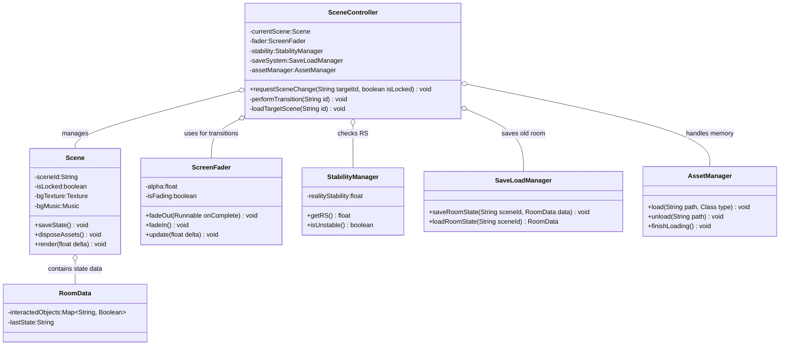
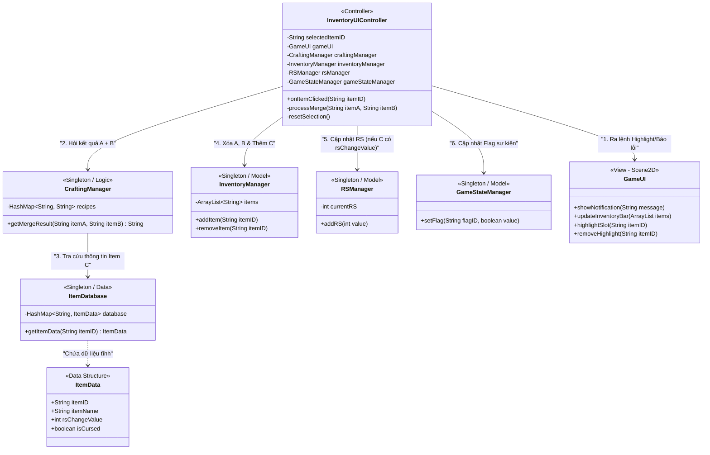

```mermaid
classDiagram
    class GameLauncher {
        +main() void
    }

    class GameManager {
        -gameState : GameState
        -mainMenu : MainMenu
        -pauseMenu : PauseMenu
        -settingMenu : SettingMenu
        -sceneManager : SceneManager
        -dialogueEngine : DialogueEngine
        -inventoryManager : InventoryManager
        -metaHorrorManager : MetaHorrorManager
        -saveLoadManager : SaveLoadManager
        -stabilityManager : StabilityManager
        -flagManager : FlagManager
        -assetManager : AssetManager
        -inputHandler : InputHandler
        -endingManager : EndingManager
        -dataManager : DataManager
        +initialize() void
        +startGame() void
        +loadGame() void
        +quitGame() void
        +update(float delta) void
        +render() void
        +handleEscPress() void
    }

    class GameState {
        -currentSceneId : String
        -dialogueNodeId : String
        -inventory : List~String~
        -flags : Map~String, Boolean~
        -realityStability : float
        +serialize() String
        +deserialize(String json) void
    }

    class FlagManager {
        -flags : Map~String, Boolean~
        +initialize() void
        +setFlag(String key, boolean value) void
        +getFlag(String key) boolean
    }

    class DataManager {
        +readString(String path) String
        +writeString(String path, String data) void
        +exists(String path) boolean
    }

    class JsonParser {
        +parseConfig(String json) Map~String, String~
        +parseSaveData(String json) GameState
        +toJson(GameState state) String
    }

    class SaveLoadManager {
        -dataManager : DataManager
        -parser : JsonParser
        +saveGame(GameState state) void
        +loadGame() GameState
    }

    class MainMenu {
        +display() void
        +handleNewGame() void
        +handleLoadGame() void
        +handleSettings() void
        +handleQuit() void
    }

    class SettingMenu {
        +display() void
        +close() void
    }

    class PauseMenu {
        +display() void
        +handleContinue() void
        +handleSettings() void
        +handleQuitToMainMenu() void
    }

    class Scene {
        -sceneId : String
        +load() void
        +update(float delta) void
        +render() void
        +unload() void
    }

    class SceneManager {
        -currentScene : Scene
        +loadScene(String sceneId) void
        +update(float delta) void
        +render() void
    }

    class StabilityManager {
        -stability : float
        +initialize() void
        +decreaseStability(float amount) void
        +increaseStability(float amount) void
        +getStability() float
        +isBelowThreshold() boolean
    }

    class MetaHorrorManager {
        -stabilityManager : StabilityManager
        -flagManager : FlagManager
        +initialize() void
        +checkForMetaEvents() void
        -triggerGlitch() void
        -triggerJumpscare() void
    }

    class EndingManager {
        +checkEndingConditions(GameState state) String
        +displayEnding(String endingId) void
    }

    class DialogueEngine {
        +initialize() void
        +startDialogue(String dialogueId) void
        +advanceDialogue() void
    }

    class PuzzleManager {
        +initialize() void
        +startPuzzle(String puzzleId) void
        +checkPuzzleSolved() boolean
    }

    class InventoryManager {
        -items : List~String~
        +addItem(String itemId) void
        +removeItem(String itemId) void
        +combineItems(String idA, String idB) String
        +hasItem(String itemId) boolean
    }

    class InputHandler {
        +isKeyPressed(int key) boolean
        +isMouseButtonPressed(int button) boolean
    }

    class AssetManager {
        +loadTexture(String path) Texture
        +loadSound(String path) Sound
        +getTexture(String key) Texture
        +getSound(String key) Sound
    }

    %% Relationships
    GameLauncher --> GameManager : initializes
    GameManager o-- GameState : holds current state
    GameManager --> FlagManager : uses to check boot flags
    GameManager --> JsonParser : uses to parse config
    GameManager --> SaveLoadManager : delegates save/load
    GameManager --> MainMenu : manages display
    GameManager --> SettingMenu : manages display
    GameManager --> PauseMenu : manages display
    GameManager --> SceneManager : manages scene loading
    GameManager --> StabilityManager : monitors reality stability
    GameManager --> MetaHorrorManager : delegates meta horror logic
    GameManager --> EndingManager : delegates ending check
    GameManager o-- DialogueEngine : owns
    GameManager o-- PuzzleManager : owns
    GameManager o-- InventoryManager : owns
    GameManager o-- InputHandler : owns
    GameManager o-- AssetManager : owns
    GameManager --> DataManager : uses for config loading

    GameState -- JsonParser : uses for serializing
    SaveLoadManager -- JsonParser : uses for parsing/serializing
    SaveLoadManager --> DataManager : uses for file IO

    PauseMenu ..> GameManager : quit/continue requests

    SceneManager *-- Scene : contains current
    Scene <|-- DialogueScene : extends
    Scene <|-- PuzzleScene : extends

    MetaHorrorManager --> StabilityManager : uses
    MetaHorrorManager --> FlagManager : uses

    EndingManager --> GameState : checks conditions
    EndingManager --> AssetManager : displays credits
```

```mermaid
classDiagram
    class SceneController {
        -currentScene:Scene
        -fader:ScreenFader
        -stability:StabilityManager
        -saveSystem:SaveLoadManager
        -assetManager:AssetManager
        +requestSceneChange(String targetId, boolean isLocked)void
        -performTransition(String id)void
        -loadTargetScene(String id)void
    }

    class Scene {
        -sceneId:String
        -isLocked:boolean
        -bgTexture:Texture
        -bgMusic:Music
        +saveState()void
        +disposeAssets()void
        +render(float delta)void
    }

    class ScreenFader {
        -alpha:float
        -isFading:boolean
        +fadeOut(Runnable onComplete)void
        +fadeIn()void
        +update(float delta)void
    }

    class StabilityManager {
        -realityStability:float
        +getRS()float
        +isUnstable()boolean
    }

    class SaveLoadManager {
        +saveRoomState(String sceneId, RoomData data)void
        +loadRoomState(String sceneId)RoomData
    }

    class AssetManager {
        +load(String path, Class type)void
        +unload(String path)void
        +finishLoading()void
    }

    class RoomData {
        -interactedObjects:Map~String, Boolean~
        -lastState:String
    }

    %% Relationships
    SceneController o-- Scene : manages
    SceneController o-- ScreenFader : uses for transitions
    SceneController o-- StabilityManager : checks RS
    SceneController o-- SaveLoadManager : saves old room
    SceneController o-- AssetManager : handles memory
    Scene o-- RoomData : contains state data
```

--- 
## Inventory & Item Collection Class UML

```mermaid
classDiagram
%% ==========================================
%% 1. CORE LIBGDX & ASHLEY API
%% ==========================================
    class InputProcessor {
<<Interface - LibGDX>>
+touchDown(int screenX, int screenY, int pointer, int button) boolean
}
class EntitySystem {
<<Class - Ashley>>
+update(float deltaTime)
}
class Engine {
<<Class - Ashley>>
+removeEntity(Entity entity)
}
class ComponentMapper~T~ {
<<Class - Ashley>>
+get(Entity e) T
}

%% ==========================================
%% 2. NHÓM COMPONENTS (DỮ LIỆU VẬT THỂ)
%% ==========================================
class TransformComponent {
<<Component>>
+Vector2 position
}
class BoundsComponent {
<<Component>>
+Rectangle hitbox
}
class ItemInfoComponent {
<<Component>>
+String itemID
+String inspectText
+String pickupSoundID
}
class CollectibleComponent {
<<Component - Marker>>
}
class RSModifierComponent {
<<Component>>
+int rsChangeValue
}

%% ==========================================
%% 3. NHÓM MODELS (SINGLETON)
%% ==========================================
class InventoryManager {
<<Singleton / Model>>
-ArrayList~String~ items
+addItem(String itemID)
    }
class GameStateManager {
<<Singleton / Model>>
-HashMap~String, Boolean~ globalFlags
+setFlag(String flagID, boolean value)
}
class RSManager {
<<Singleton / Model>>
-int currentRS
+addRS(int value)
}

%% ==========================================
%% 4. NHÓM VIEW & UTILITY (PHẢN HỒI)
%% ==========================================
class AudioManager {
<<Singleton / Utility>>
+playSound(String soundID)
}
class GameUI {
<<View - Scene2D>>
+showNotification(String message)
+updateInventoryBar(ArrayList items)
+showDialogue(String text)
}

%% ==========================================
%% 5. BỘ NÃO ĐIỀU KHIỂN (CONTROLLER / SYSTEM)
%% ==========================================
class PlayerInteractionSystem {
<<System / Controller>>
-Engine engine
-OrthographicCamera camera

%% Mappers để lấy Component siêu nhanh
-ComponentMapper~BoundsComponent~ bm
-ComponentMapper~ItemInfoComponent~ im
-ComponentMapper~CollectibleComponent~ cm
-ComponentMapper~RSModifierComponent~ rm

-AudioManager audioManager
-GameUI gameUI

+touchDown(int screenX, int screenY, int pointer, int button) boolean
-processClick(float worldX, float worldY)
-pickupItem(Entity entity)
-inspectItem(Entity entity)
}

%% --- MỐI QUAN HỆ LẮNG NGHE & KẾ THỪA ---
PlayerInteractionSystem ..|> InputProcessor : "Lắng nghe click chuột"
PlayerInteractionSystem --|> EntitySystem : "Chạy ngầm liên tục"

%% --- MỐI QUAN HỆ GỌI HÀM ---
PlayerInteractionSystem --> Engine : "Gọi xóa Entity"
PlayerInteractionSystem --> ComponentMapper : "Quét Component"
PlayerInteractionSystem --> BoundsComponent : "Check hitbox.contains(x,y)"

PlayerInteractionSystem --> InventoryManager : "Lưu vào túi đồ"
PlayerInteractionSystem --> GameStateManager : "Cập nhật Flag"
PlayerInteractionSystem --> RSManager : "Cộng/Trừ RS"

PlayerInteractionSystem --> AudioManager : "Phát tiếng động"
PlayerInteractionSystem --> GameUI : "Cập nhật giao diện"
```
---
## Item Merging Logic Class UML

```mermaid
classDiagram
    %% ==========================================
    %% 1. NHÓM ĐIỀU KHIỂN UI (UI CONTROLLER)
    %% ==========================================
    class InventoryUIController {
        <<Controller>>
        -String selectedItemID
        -GameUI gameUI
        -CraftingManager craftingManager
        -InventoryManager inventoryManager
        -RSManager rsManager
        -GameStateManager gameStateManager
        
        +onItemClicked(String itemID)
        -processMerge(String itemA, String itemB)
        -resetSelection()
    }

    %% ==========================================
    %% 2. NHÓM QUẢN LÝ CÔNG THỨC & DỮ LIỆU (MODEL)
    %% ==========================================
    class CraftingManager {
        <<Singleton / Logic>>
        -HashMap~String, String~ recipes
        +getMergeResult(String itemA, String itemB) String
    }

    class ItemDatabase {
        <<Singleton / Data>>
        -HashMap~String, ItemData~ database
        +getItemData(String itemID) ItemData
    }

    class ItemData {
        <<Data Structure>>
        +String itemID
        +String itemName
        +int rsChangeValue
        +boolean isCursed
    }

    %% ==========================================
    %% 3. NHÓM KHO ĐỒ & THỰC TẠI (SINGLETON MODELS)
    %% ==========================================
    class InventoryManager {
        <<Singleton / Model>>
        -ArrayList~String~ items
        +addItem(String itemID)
        +removeItem(String itemID)
    }

    class RSManager {
        <<Singleton / Model>>
        -int currentRS
        +addRS(int value)
    }

    class GameStateManager {
        <<Singleton / Model>>
        +setFlag(String flagID, boolean value)
    }

    %% ==========================================
    %% 4. NHÓM GIAO DIỆN (VIEW)
    %% ==========================================
    class GameUI {
        <<View - Scene2D>>
        +showNotification(String message)
        +updateInventoryBar(ArrayList items)
        +highlightSlot(String itemID)
        +removeHighlight(String itemID)
    }

    %% --- MỐI QUAN HỆ TƯƠNG TÁC CHÍNH ---
    InventoryUIController --> GameUI : "1. Ra lệnh Highlight/Báo lỗi"
    InventoryUIController --> CraftingManager : "2. Hỏi kết quả A + B"
    CraftingManager --> ItemDatabase : "3. Tra cứu thông tin Item C"
    ItemDatabase ..> ItemData : "Chứa dữ liệu tĩnh"

    InventoryUIController --> InventoryManager : "4. Xóa A, B & Thêm C"
    InventoryUIController --> RSManager : "5. Cập nhật RS (nếu C có rsChangeValue)"
    InventoryUIController --> GameStateManager : "6. Cập nhật Flag sự kiện"
```