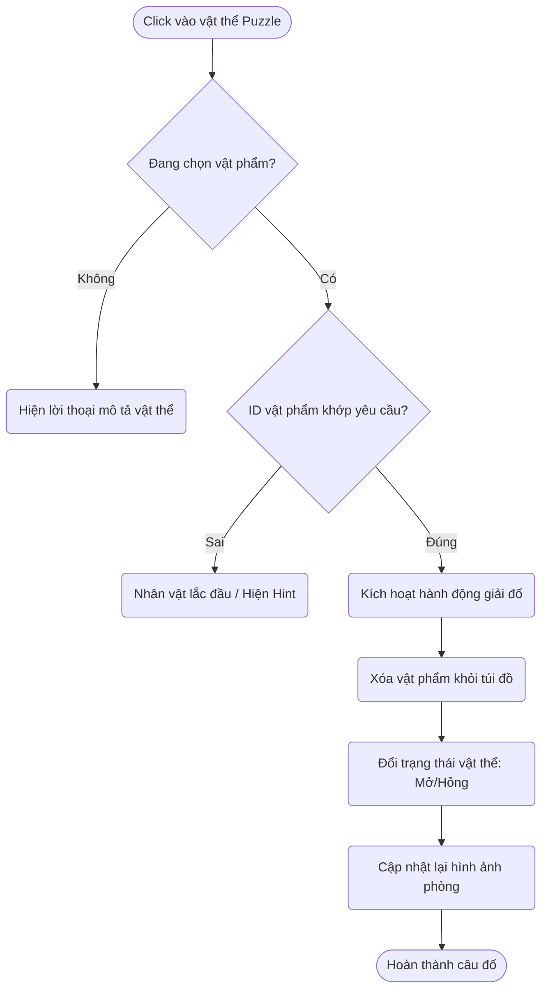
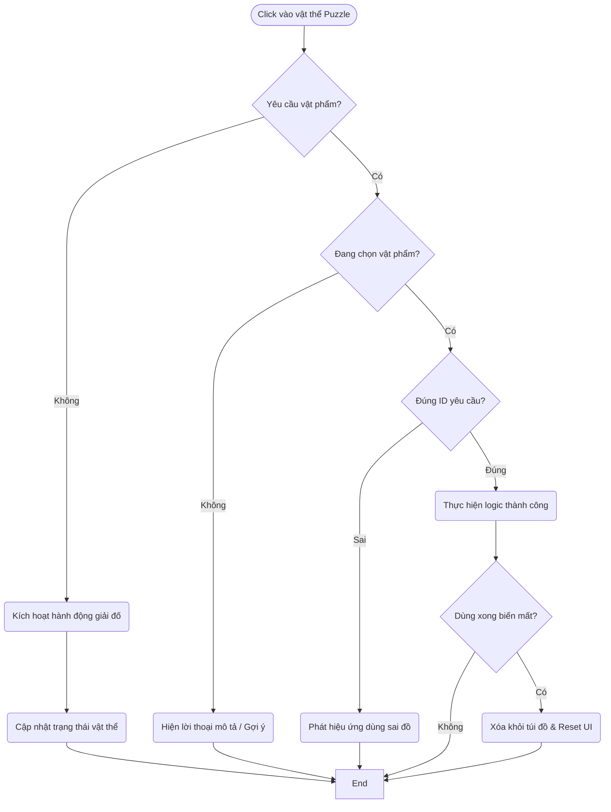
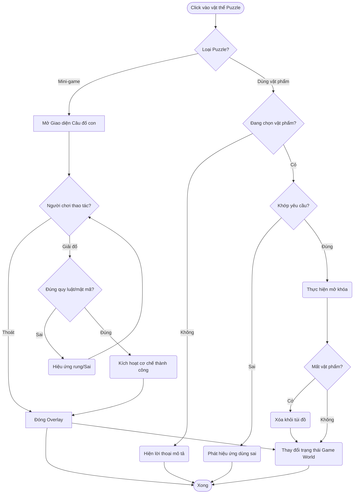
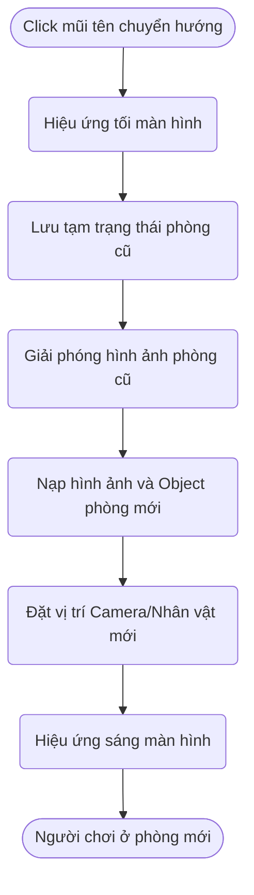

```mermaid
flowchart TD
%% Main Menu Flow
    Start_Main([Khởi động Game]) --> MainUI["Hiển thị Main Menu"]
    MainUI --> Main_Choice{"Người chơi chọn?"}

    Main_Choice -- "New Game" --> Init_Game(Khởi tạo Game mới)
    Main_Choice -- "Load Game" --> Load_Save(Đọc file Save)
    Main_Choice -- "Setting" --> Sub_Setting[[Giao diện Cài đặt]]
    Main_Choice -- "About" --> Credits(Hiện thông tin tác giả)
    Main_Choice -- "Quit" --> Exit_App([Thoát ứng dụng])

%% In-game Menu Flow
    Start_Pause([Nhấn ESC / Pause]) --> PauseUI["Hiển thị Pause Menu"]
    PauseUI --> Pause_Choice{"Người chơi chọn?"}

    Pause_Choice -- "Resume" --> Close_Pause(Đóng Menu & Chơi tiếp)
    Pause_Choice -- "Save Game" --> Save_Process(Ghi dữ liệu vào file)
    Pause_Choice -- "Setting" --> Sub_Setting
    Pause_Choice -- "Main Menu" --> MainUI
    Pause_Choice -- "Quit" --> Exit_App

%% Sub-processes
    Init_Game --> Play([Bắt đầu Gameplay])
    Load_Save --> Play
    Close_Pause --> Play
```

```mermaid
flowchart TD
    Start([Click vào vật thể Puzzle]) --> SelectItem{Đang chọn vật phẩm?}
    
    SelectItem -- Không --> Examine(Hiện lời thoại mô tả vật thể)
    
    SelectItem -- Có --> MatchID{ID vật phẩm khớp yêu cầu?}
    
    MatchID -- Sai --> PlayFail(Nhân vật lắc đầu / Hiện Hint)
    
    MatchID -- Đúng --> ExecutePuzzle(Kích hoạt hành động giải đố)
    ExecutePuzzle --> RemoveItem(Xóa vật phẩm khỏi túi đồ)
    RemoveItem --> ChangeState(Đổi trạng thái vật thể: Mở/Hỏng)
    ChangeState --> UpdateScene(Cập nhật lại hình ảnh phòng)
    UpdateScene --> End([Hoàn thành câu đố])
```

```mermaid
flowchart TD
    Start([Click vào vật thể Puzzle]) --> CheckReq{Yêu cầu vật phẩm?}

    %% Nhánh không yêu cầu item
    CheckReq -- Không --> DirectAction(Kích hoạt hành động giải đố)
    DirectAction --> UpdateState(Cập nhật trạng thái vật thể)
    UpdateState --> End

    %% Nhánh yêu cầu item
    CheckReq -- Có --> IsHolding{Đang chọn vật phẩm?}
    
    IsHolding -- Không --> ShowHint(Hiện lời thoại mô tả / Gợi ý)
    ShowHint --> End
    
    IsHolding -- Có --> MatchID{Đúng ID yêu cầu?}
    
    MatchID -- Sai --> PlayFail(Phát hiệu ứng dùng sai đồ)
    PlayFail --> End
    
    MatchID -- Đúng --> SuccessLogic(Thực hiện logic thành công)
    SuccessLogic --> Consume{Dùng xong biến mất?}
    
    Consume -- Có --> RemoveItem(Xóa khỏi túi đồ & Reset UI)
    Consume -- Không --> End
    RemoveItem --> End
```

```mermaid
flowchart TD
    Start([Click vào vật thể Puzzle]) --> TypeCheck{Loại Puzzle?}

    %% Nhánh Mini-game (Mật mã, sắp xếp, v.v...)
    TypeCheck -- "Mini-game" --> OpenOverlay[Mở Giao diện Câu đố con]
    OpenOverlay --> SubInteraction{Người chơi thao tác?}
    
    SubInteraction -- "Thoát" --> CloseOverlay[Đóng Overlay]
    CloseOverlay --> End
    
    SubInteraction -- "Giải đố" --> LogicCheck{Đúng quy luật/mật mã?}
    LogicCheck -- Sai --> ShakeAnim(Hiệu ứng rung/Sai)
    ShakeAnim --> SubInteraction
    
    LogicCheck -- Đúng --> SuccessAction(Kích hoạt cơ chế thành công)
    SuccessAction --> CloseOverlay
    CloseOverlay --> UpdateWorld(Thay đổi trạng thái Game World)

    %% Nhánh Item Puzzle (Mở khóa bằng đồ vật)
    TypeCheck -- "Dùng vật phẩm" --> IsHolding{Đang chọn vật phẩm?}
    
    IsHolding -- Không --> Examine(Hiện lời thoại mô tả)
    Examine --> End
    
    IsHolding -- Có --> MatchID{Khớp yêu cầu?}
    
    MatchID -- Sai --> PlayFail(Phát hiệu ứng dùng sai)
    PlayFail --> End
    
    MatchID -- Đúng --> ExecutePuzzle(Thực hiện mở khóa)
    ExecutePuzzle --> ConsumeCheck{Mất vật phẩm?}
    
    ConsumeCheck -- Có --> RemoveItem(Xóa khỏi túi đồ)
    ConsumeCheck -- Không --> UpdateWorld
    RemoveItem --> UpdateWorld
    UpdateWorld --> End([Xong])
```

```mermaid
flowchart TD
    Start([Click mũi tên chuyển hướng]) --> FadeOut(Hiệu ứng tối màn hình)
    FadeOut --> SaveCurrent(Lưu tạm trạng thái phòng cũ)
    SaveCurrent --> ClearAssets(Giải phóng hình ảnh phòng cũ)
    
    ClearAssets --> LoadNew(Nạp hình ảnh và Object phòng mới)
    LoadNew --> PositionPlayer(Đặt vị trí Camera/Nhân vật mới)
    PositionPlayer --> FadeIn(Hiệu ứng sáng màn hình)
    FadeIn --> End([Người chơi ở phòng mới])
```