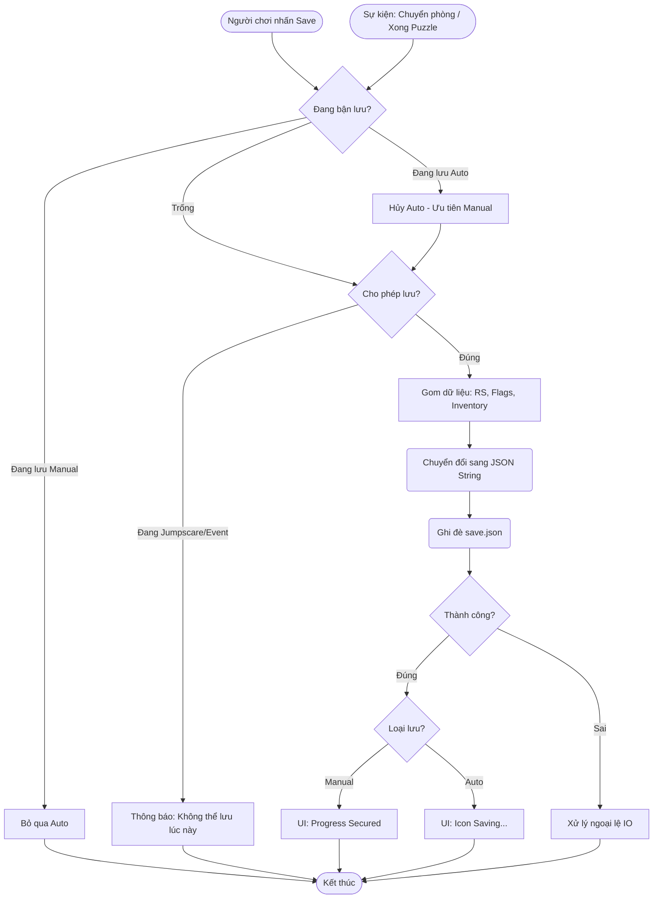
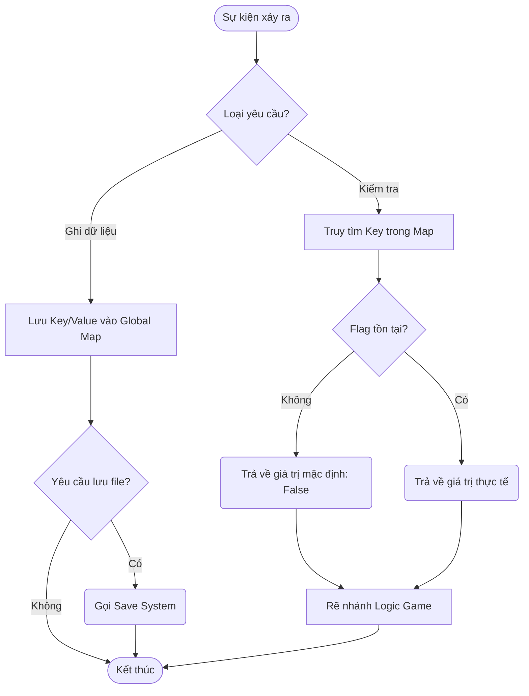
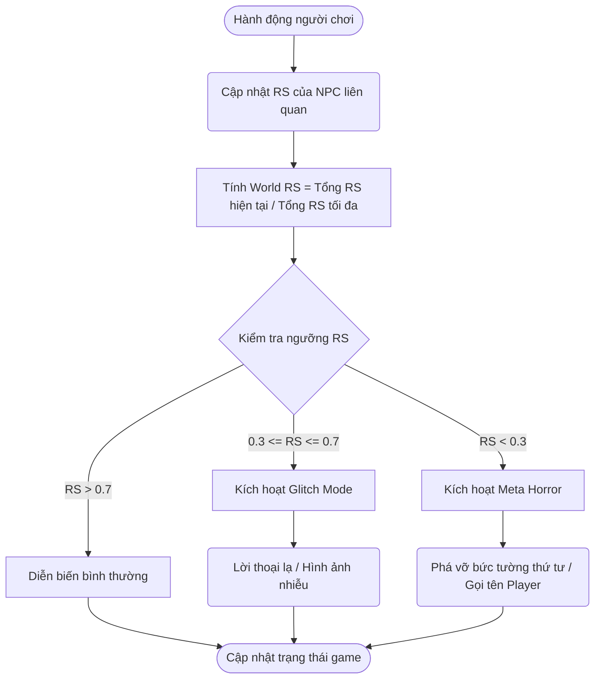
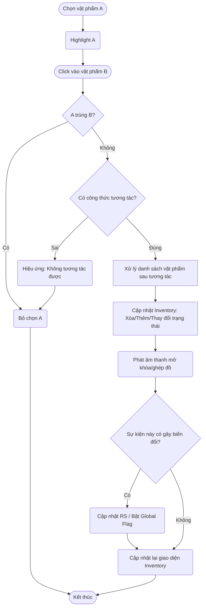
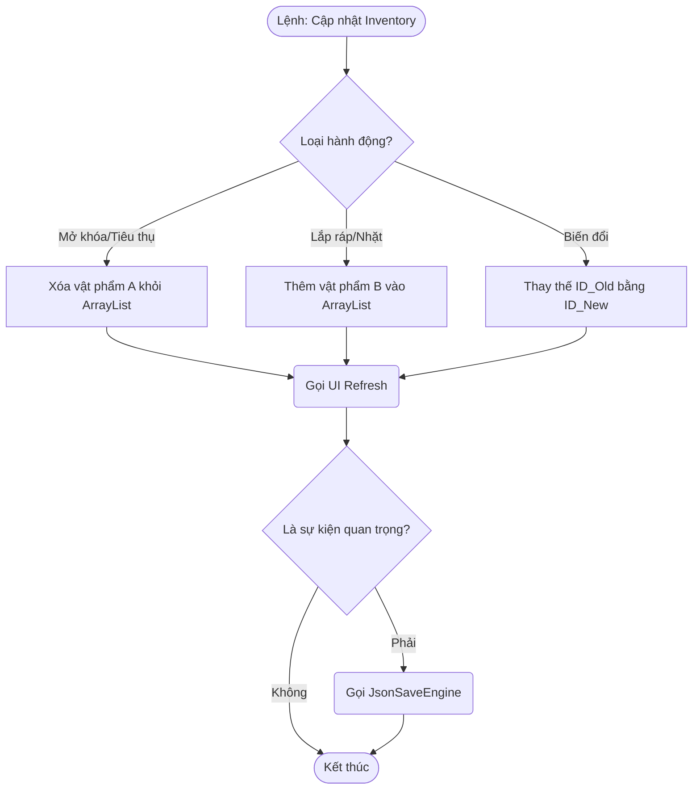

save game uml

```mermaid
flowchart TD
%% Hai nguồn kích hoạt
    TriggerManual([Người chơi nhấn Save]) --> CheckPriority{Đang bận lưu?}
    TriggerAuto([Sự kiện: Chuyển phòng / Xong Puzzle]) --> CheckPriority

%% Logic ưu tiên
    CheckPriority -- "Đang lưu Auto" --> Interrupt[Hủy Auto - Ưu tiên Manual]
    CheckPriority -- "Đang lưu Manual" --> IgnoreAuto[Bỏ qua Auto]
    CheckPriority -- "Trống" --> SavePermission{Cho phép lưu?}

    Interrupt --> SavePermission
    IgnoreAuto --> End([Kết thúc])

%% Kiểm tra trạng thái meta/cốt truyện
    SavePermission -- "Đang Jumpscare/Event" --> Deny[Thông báo: Không thể lưu lúc này]
    SavePermission -- "Đúng" --> Collect[Gom dữ liệu: RS, Flags, Inventory]

    Deny --> End

%% Luồng ghi JSON
    Collect --> JsonFormat(Chuyển đổi sang JSON String)
    JsonFormat --> WriteFile(Ghi đè save.json)

    WriteFile --> Verify{Thành công?}
    Verify -- "Sai" --> Catch[Xử lý ngoại lệ IO]
    Verify -- "Đúng" --> Feedback{Loại lưu?}

    Feedback -- "Manual" --> Success[UI: Progress Secured]
    Feedback -- "Auto" --> Silent[UI: Icon Saving...]

    Success --> End
    Silent --> End
    Catch --> End
```

---
ending system

```mermaid
flowchart TD
    Start([Kích hoạt Sự kiện cuối]) --> FetchData(Truy xuất World RS & Global Flags)
    FetchData --> ConditionCheck{Kiểm tra điều kiện}
    
    %% Nhánh True Ending
    ConditionCheck -- "RS > 80% + Đủ Item ẩn" --> TrueEnd[True Ending: Thực tại ổn định]
    
    %% Nhánh Hidden Ending (Dành cho dân cày)
    ConditionCheck -- "Đạt Flag đặc biệt" --> SecretEnd[Secret Ending: Sự thật về thế giới]
    
    %% Nhánh Normal Ending
    ConditionCheck -- "50% < RS < 80%" --> NormalEnd[Normal Ending: Kết thúc mở]
    
    %% Nhánh Bad/Horror Ending (Meta)
    ConditionCheck -- "RS < 30%" --> HorrorEnd[Horror Ending: Thực tại sụp đổ]
    
    HorrorEnd --> MetaAction(Xóa file save/Gửi thông điệp qua System)
    
    TrueEnd --> PlayCredits(Chạy Credits)
    SecretEnd --> PlayCredits
    NormalEnd --> PlayCredits
    MetaAction --> PlayCredits
    
    PlayCredits --> End([Trở về Main Menu])
```
---
flag / key system

```mermaid
flowchart TD
    Start([Sự kiện xảy ra]) --> RequestType{Loại yêu cầu?}
    
    %% Luồng cập nhật
    RequestType -- "Ghi dữ liệu" --> UpdateFlag[Lưu Key/Value vào Global Map]
    UpdateFlag --> AutoSave{Yêu cầu lưu file?}
    AutoSave -- "Có" --> TriggerSave(Gọi Save System)
    AutoSave -- "Không" --> End([Kết thúc])
    TriggerSave --> End

    %% Luồng truy vấn (Dùng cho rẽ nhánh)
    RequestType -- "Kiểm tra" --> QueryMap[Truy tìm Key trong Map]
    QueryMap --> ExistCheck{Flag tồn tại?}
    
    ExistCheck -- "Không" --> DefaultValue(Trả về giá trị mặc định: False)
    ExistCheck -- "Có" --> GetValue(Trả về giá trị thực tế)
    
    DefaultValue --> LogicBranch[Rẽ nhánh Logic Game]
    GetValue --> LogicBranch
    LogicBranch --> End
```
---
rs system

```mermaid
flowchart TD
    Start([Hành động người chơi]) --> ChangeRS(Cập nhật RS của NPC liên quan)
    ChangeRS --> CalcWorldRS[Tính World RS = Tổng RS hiện tại / Tổng RS tối đa]
    
    CalcWorldRS --> Threshold{Kiểm tra ngưỡng RS}
    
    %% Nhánh bình thường
    Threshold -- "RS > 0.7" --> Normal[Diễn biến bình thường]
    Normal --> End([Cập nhật trạng thái game])
    
    %% Nhánh bất ổn (Glitch)
    Threshold -- "0.3 <= RS <= 0.7" --> Unstable[Kích hoạt Glitch Mode]
    Unstable --> GlitchEffect(Lời thoại lạ / Hình ảnh nhiễu)
    GlitchEffect --> End
    
    %% Nhánh sụp đổ (Meta/Horror)
    Threshold -- "RS < 0.3" --> Broken[Kích hoạt Meta Horror]
    Broken --> FourthWall(Phá vỡ bức tường thứ tư / Gọi tên Player)
    FourthWall --> End
```
---

merge logic 

```mermaid
flowchart TD
    Start([Chọn vật phẩm A]) --> Highlight(Highlight A)
    Highlight --> SelectB([Click vào vật phẩm B])
    
    SelectB --> SameCheck{A trùng B?}
    SameCheck -- "Có" --> Deselect(Bỏ chọn A)
    
    SameCheck -- "Không" --> RecipeCheck{Có công thức tương tác?}
    
    %% Nhánh thất bại
    RecipeCheck -- "Sai" --> FailAnim(Hiệu ứng: Không tương tác được)
    FailAnim --> Deselect
    
    %% Nhánh thành công (Xử lý linh hoạt)
    RecipeCheck -- "Đúng" --> ProcessRecipe[Xử lý danh sách vật phẩm sau tương tác]
    ProcessRecipe --> UpdateInv[Cập nhật Inventory: Xóa/Thêm/Thay đổi trạng thái]
    
    UpdateInv --> PlaySuccess(Phát âm thanh mở khóa/ghép đồ)
    PlaySuccess --> RSCheck{Sự kiện này có gây biến đổi?}
    
    RSCheck -- "Có" --> UpdateRS(Cập nhật RS / Bật Global Flag)
    RSCheck -- "Không" --> RefreshUI(Cập nhật lại giao diện Inventory)
    
    UpdateRS --> RefreshUI
    RefreshUI --> End([Kết thúc])
    Deselect --> End
```
---
update inventory uml

```mermaid
flowchart TD
    UpdateStart([Lệnh: Cập nhật Inventory]) --> TaskType{Loại hành động?}
    
    TaskType -- "Mở khóa/Tiêu thụ" --> RemoveItem[Xóa vật phẩm A khỏi ArrayList]
    TaskType -- "Lắp ráp/Nhặt" --> AddItem[Thêm vật phẩm B vào ArrayList]
    TaskType -- "Biến đổi" --> ReplaceItem[Thay thế ID_Old bằng ID_New]
    
    RemoveItem --> SyncUI(Gọi UI Refresh)
    AddItem --> SyncUI
    ReplaceItem --> SyncUI
    
    SyncUI --> SaveCheck{Là sự kiện quan trọng?}
    SaveCheck -- "Phải" --> AutoSave(Gọi JsonSaveEngine)
    SaveCheck -- "Không" --> End([Kết thúc])
    AutoSave --> End
```