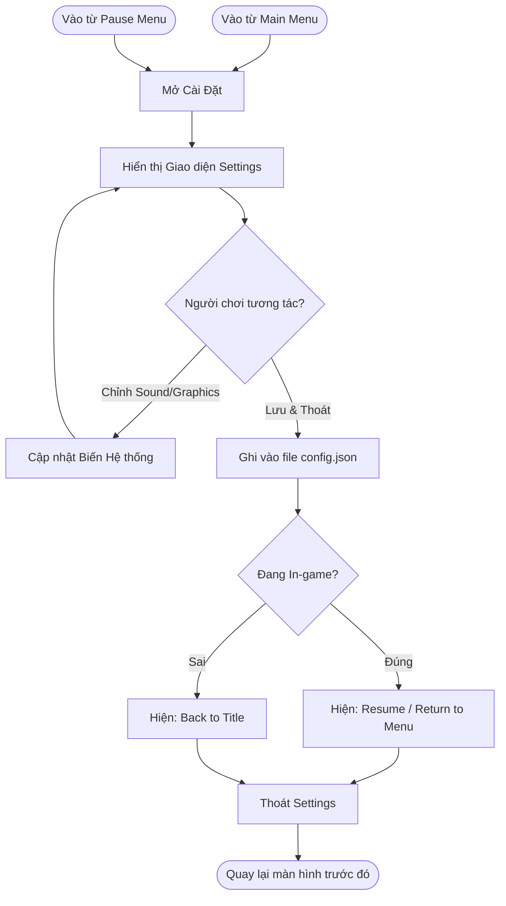

```mermaid
flowchart TD
    Start_Menu(["Vào từ Main Menu"]) --> OpenSettings["Mở Cài Đặt"]
    Start_InGame(["Vào từ Pause Menu"]) --> OpenSettings

    OpenSettings --> DisplayUI["Hiển thị Giao diện Settings"]
    
    DisplayUI --> Interaction{"Người chơi tương tác?"}
    
    Interaction -- "Chỉnh Sound/Graphics" --> ApplyGeneric["Cập nhật Biến Hệ thống"]
    ApplyGeneric --> DisplayUI

    Interaction -- "Lưu & Thoát" --> SaveData["Ghi vào file config.json"]
    
    SaveData --> ContextCheck{"Đang In-game?"}
    
    ContextCheck -- "Đúng" --> InGameOptions["Hiện: Resume / Return to Menu"]
    ContextCheck -- "Sai" --> MenuOptions["Hiện: Back to Title"]
    
    InGameOptions --> Exit["Thoát Settings"]
    MenuOptions --> Exit
    Exit --> End(["Quay lại màn hình trước đó"])
```