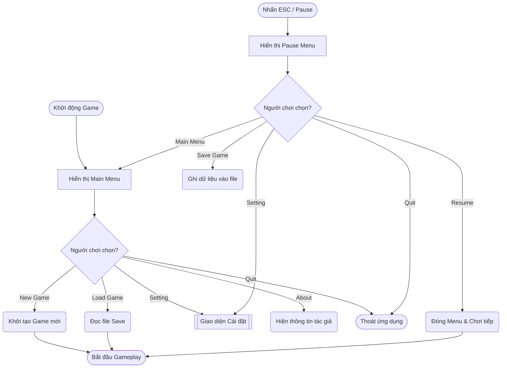

```mermaid
flowchart TD
%% Main Menu Flow
    Start_Main([Khởi động Game]) --> MainUI["Hiển thị Main Menu"]
    MainUI --> Main_Choice{"Người chơi chọn?"}

    Main_Choice -- "New Game" --> Init_Game(Khởi tạo Game mới)
    Main_Choice -- "Load Game" --> Load_Save(Đọc file Save)
    Main_Choice -- "Setting" --> Sub_Setting[[Giao diện Cài đặt]]
    Main_Choice -- "About" --> Credits(Hiện thông tin tác giả)
    Main_Choice -- "Quit" --> Exit_App([Thoát ứng dụng])

%% In-game Menu Flow
    Start_Pause([Nhấn ESC / Pause]) --> PauseUI["Hiển thị Pause Menu"]
    PauseUI --> Pause_Choice{"Người chơi chọn?"}

    Pause_Choice -- "Resume" --> Close_Pause(Đóng Menu & Chơi tiếp)
    Pause_Choice -- "Save Game" --> Save_Process(Ghi dữ liệu vào file)
    Pause_Choice -- "Setting" --> Sub_Setting
    Pause_Choice -- "Main Menu" --> MainUI
    Pause_Choice -- "Quit" --> Exit_App

%% Sub-processes
    Init_Game --> Play([Bắt đầu Gameplay])
    Load_Save --> Play
    Close_Pause --> Play
```