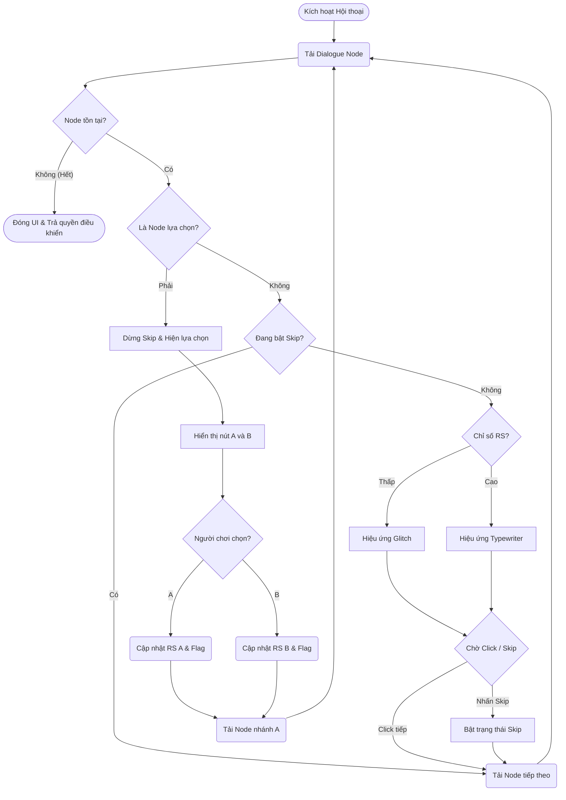

```mermaid
flowchart TD
    Start([Kích hoạt Hội thoại]) --> LoadNode(Tải Dialogue Node)

%% Kiểm tra điểm dừng ngay khi nạp
    LoadNode --> ExistCheck{Node tồn tại?}
    ExistCheck -- "Không (Hết)" --> EndDialogue([Đóng UI & Trả quyền điều khiển])

%% Nếu tồn tại thì mới chạy tiếp logic
    ExistCheck -- "Có" --> IsDecision{Là Node lựa chọn?}

    IsDecision -- "Phải" --> StopSkip[Dừng Skip & Hiện lựa chọn]
    StopSkip --> ShowChoices[Hiển thị nút A và B]

    IsDecision -- "Không" --> SkipCheck{Đang bật Skip?}

    SkipCheck -- "Có" --> AutoNext(Tải Node tiếp theo)
    AutoNext --> LoadNode

    SkipCheck -- "Không" --> RSCheck{Chỉ số RS?}
    RSCheck -- "Thấp" --> Glitch[Hiệu ứng Glitch]
    RSCheck -- "Cao" --> Typewriter[Hiệu ứng Typewriter]

    Glitch --> WaitInput{Chờ Click / Skip}
    Typewriter --> WaitInput

    WaitInput -- "Nhấn Skip" --> SetSkip[Bật trạng thái Skip]
    WaitInput -- "Click tiếp" --> AutoNext
    SetSkip --> AutoNext

    UserSelect{Người chơi chọn?}
    ShowChoices --> UserSelect
    UserSelect -- "A" --> UpdateRSA(Cập nhật RS A & Flag)
    UserSelect -- "B" --> UpdateRSB(Cập nhật RS B & Flag)

    UpdateRSA --> NextBranch(Tải Node nhánh A)
    UpdateRSB --> NextBranch
    NextBranch --> LoadNode
```