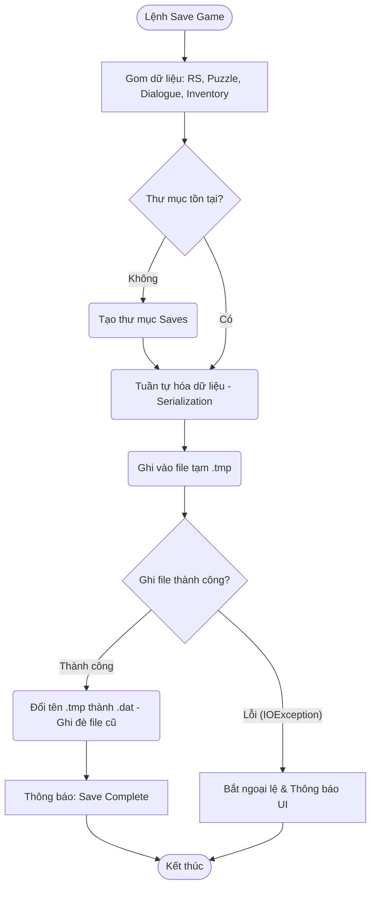
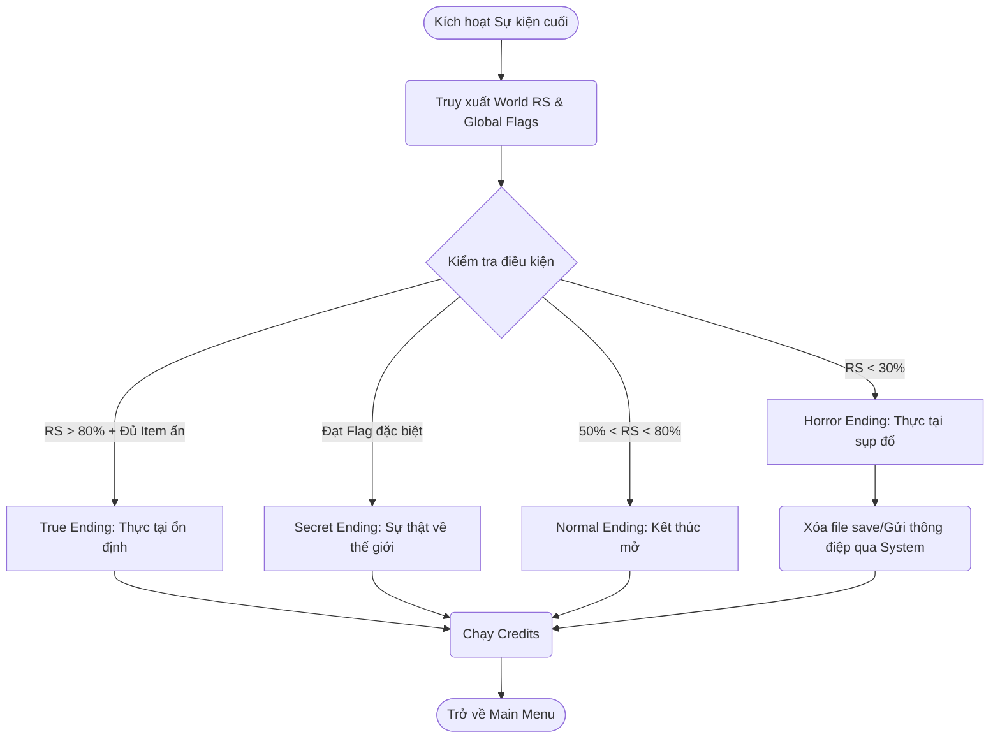
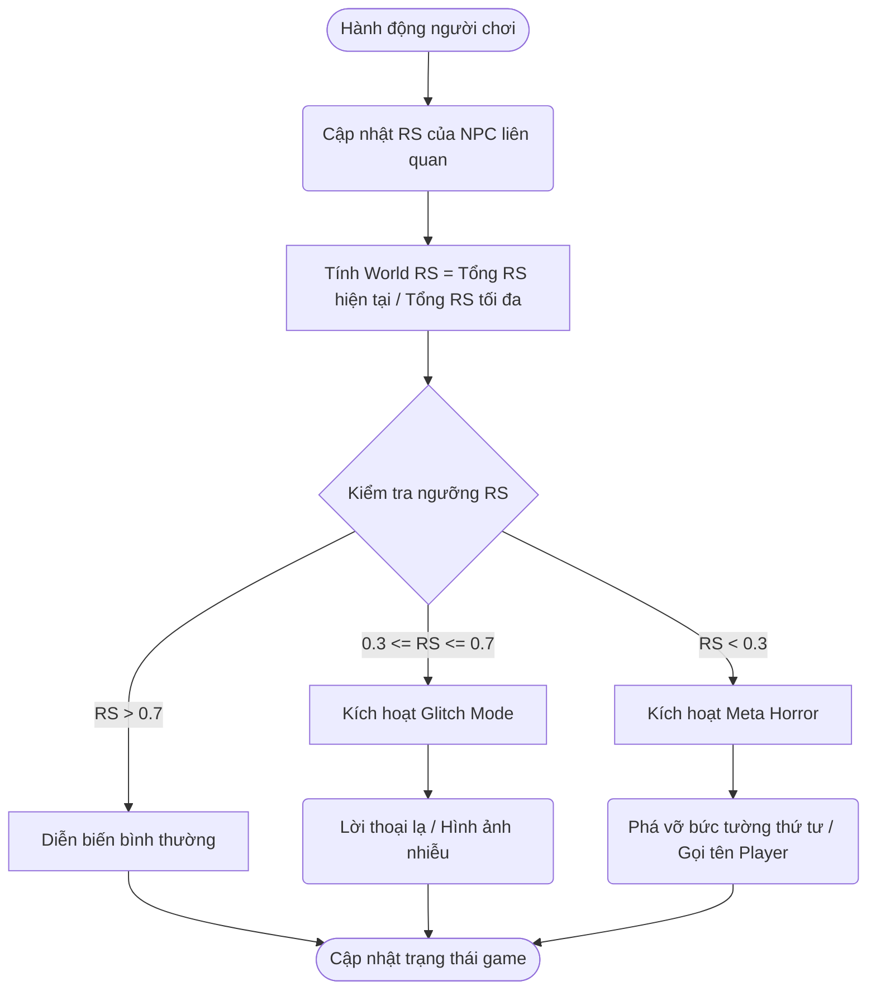
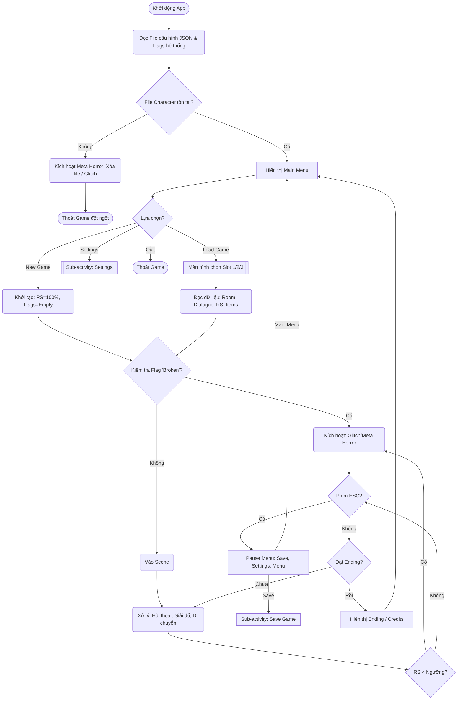

```mermaid
flowchart TD
    Start([Lệnh Save Game]) --> Collect[Gom dữ liệu: RS, Puzzle, Dialogue, Inventory]
    Collect --> CheckDir{Thư mục tồn tại?}

    CheckDir -- "Không" --> CreateDir(Tạo thư mục Saves)
    CreateDir --> Serialize
    CheckDir -- "Có" --> Serialize(Tuần tự hóa dữ liệu - Serialization)

    Serialize --> WriteTemp(Ghi vào file tạm .tmp)
    WriteTemp --> Verify{Ghi file thành công?}

    Verify -- "Lỗi (IOException)" --> CatchErr[Bắt ngoại lệ & Thông báo UI]
    Verify -- "Thành công" --> Rename(Đổi tên .tmp thành .dat - Ghi đè file cũ)

    Rename --> Success[Thông báo: Save Complete]
    Success --> End([Kết thúc])
    CatchErr --> End
```

```mermaid
flowchart TD
    Start([Kích hoạt Sự kiện cuối]) --> FetchData(Truy xuất World RS & Global Flags)
    FetchData --> ConditionCheck{Kiểm tra điều kiện}
    
    %% Nhánh True Ending
    ConditionCheck -- "RS > 80% + Đủ Item ẩn" --> TrueEnd[True Ending: Thực tại ổn định]
    
    %% Nhánh Hidden Ending (Dành cho dân cày)
    ConditionCheck -- "Đạt Flag đặc biệt" --> SecretEnd[Secret Ending: Sự thật về thế giới]
    
    %% Nhánh Normal Ending
    ConditionCheck -- "50% < RS < 80%" --> NormalEnd[Normal Ending: Kết thúc mở]
    
    %% Nhánh Bad/Horror Ending (Meta)
    ConditionCheck -- "RS < 30%" --> HorrorEnd[Horror Ending: Thực tại sụp đổ]
    
    HorrorEnd --> MetaAction(Xóa file save/Gửi thông điệp qua System)
    
    TrueEnd --> PlayCredits(Chạy Credits)
    SecretEnd --> PlayCredits
    NormalEnd --> PlayCredits
    MetaAction --> PlayCredits
    
    PlayCredits --> End([Trở về Main Menu])
```

```mermaid
flowchart TD
    Start([Sự kiện xảy ra]) --> RequestType{Loại yêu cầu?}
    
    %% Luồng cập nhật
    RequestType -- "Ghi dữ liệu" --> UpdateFlag[Lưu Key/Value vào Global Map]
    UpdateFlag --> AutoSave{Yêu cầu lưu file?}
    AutoSave -- "Có" --> TriggerSave(Gọi Save System)
    AutoSave -- "Không" --> End([Kết thúc])
    TriggerSave --> End

    %% Luồng truy vấn (Dùng cho rẽ nhánh)
    RequestType -- "Kiểm tra" --> QueryMap[Truy tìm Key trong Map]
    QueryMap --> ExistCheck{Flag tồn tại?}
    
    ExistCheck -- "Không" --> DefaultValue(Trả về giá trị mặc định: False)
    ExistCheck -- "Có" --> GetValue(Trả về giá trị thực tế)
    
    DefaultValue --> LogicBranch[Rẽ nhánh Logic Game]
    GetValue --> LogicBranch
    LogicBranch --> End
```

```mermaid
flowchart TD
    Start([Hành động người chơi]) --> ChangeRS(Cập nhật RS của NPC liên quan)
    ChangeRS --> CalcWorldRS[Tính World RS = Tổng RS hiện tại / Tổng RS tối đa]
    
    CalcWorldRS --> Threshold{Kiểm tra ngưỡng RS}
    
    %% Nhánh bình thường
    Threshold -- "RS > 0.7" --> Normal[Diễn biến bình thường]
    Normal --> End([Cập nhật trạng thái game])
    
    %% Nhánh bất ổn (Glitch)
    Threshold -- "0.3 <= RS <= 0.7" --> Unstable[Kích hoạt Glitch Mode]
    Unstable --> GlitchEffect(Lời thoại lạ / Hình ảnh nhiễu)
    GlitchEffect --> End
    
    %% Nhánh sụp đổ (Meta/Horror)
    Threshold -- "RS < 0.3" --> Broken[Kích hoạt Meta Horror]
    Broken --> FourthWall(Phá vỡ bức tường thứ tư / Gọi tên Player)
    FourthWall --> End
```

```mermaid
flowchart TD
    Start([Khởi động App]) --> ReadData(Đọc File cấu hình JSON & Flags hệ thống)
    ReadData --> IntegrityCheck{File Character tồn tại?}

%% Nhánh Meta Horror ngay đầu game
    IntegrityCheck -- "Không" --> MetaJumpscare(Kích hoạt Meta Horror: Xóa file / Glitch)
    MetaJumpscare --> EndMeta([Thoát Game đột ngột])

%% Nhánh bình thường
    IntegrityCheck -- "Có" --> MainMenu["Hiển thị Main Menu"]

    MainMenu --> MainChoice{Lựa chọn?}

    MainChoice -- "New Game" --> InitGame(Khởi tạo: RS=100%, Flags=Empty)
    MainChoice -- "Load Game" --> LoadScreen[[Màn hình chọn Slot 1/2/3]]
    MainChoice -- "Settings" --> Settings[[Sub-activity: Settings]]
    MainChoice -- "Quit" --> Exit([Thoát Game])

    LoadScreen --> RestoreState(Đọc dữ liệu: Room, Dialogue, RS, Items)

%% Kiểm tra Flag sau khi Load (Đề phòng người chơi gian lận hoặc File bị hỏng)
    InitGame --> PreCheck{Kiểm tra Flag 'Broken'?}
    RestoreState --> PreCheck

    PreCheck -- "Có" --> MetaEvent
    PreCheck -- "Không" --> EnterScene(Vào Scene)

%% Vòng lặp Gameplay
    EnterScene --> PlayLoop(Xử lý: Hội thoại, Giải đố, Di chuyển)
    PlayLoop --> RSMonitor{RS < Ngưỡng?}

    RSMonitor -- "Có" --> MetaEvent(Kích hoạt: Glitch/Meta Horror)
    RSMonitor -- "Không" --> InputCheck{Phím ESC?}

    MetaEvent --> InputCheck

    InputCheck -- "Có" --> PauseMenu["Pause Menu: Save, Settings, Menu"]
    InputCheck -- "Không" --> EndLogic{Đạt Ending?}

    PauseMenu -- "Save" --> SaveSys[[Sub-activity: Save Game]]
    PauseMenu -- "Main Menu" --> MainMenu

    EndLogic -- "Chưa" --> PlayLoop
    EndLogic -- "Rồi" --> EndingScreen[Hiển thị Ending / Credits]
    EndingScreen --> MainMenu
```